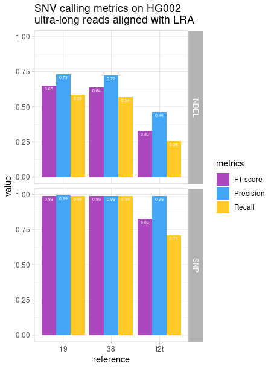
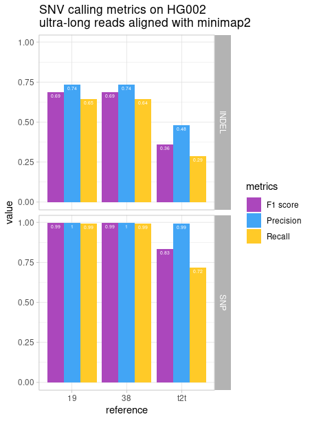

# HG002_PAG07506 Ultra Long reads
- [HG002 sample ran on PAG07506 flowcell](#hg002-sample-ran-on-pag07506-flowcell) 
  - [Basecalling](#basecalling)
  - [mapping](#mapping)
    - [minimap2](#minimap2)
    - [lra](#lra)
      - [Issue with `lra`](#issue-with-lra)
    - [QC](#qc)
      - [hg38](#hg38)
      - [hg19](#hg19)
      - [T2T](#t2t)
  - [Assembly](#assembly)
    - [Shasta](#shasta)
      - [default parameters](#default-parameters)
      - [low X parameters](#low-x-parameters)
        - [contigs aligned to hg38](#contigs-aligned-to-hg38)
        - [contigs aligned to T2T](#contigs-aligned-to-t2t)
    - [Flye](#flye)
  - [Polishing](#polishing)
    - [medaka](#medaka)
  - [Assembly evaluation](#assembly-evaluation)
    - [hg38](#hg38-1)
    - [T2T](#t2t-1)
  - [SV-call](#sv-call)
    - [lra-cuteSV](#lra-cutesv)
      - [mmi-Sniffles](#mmi-sniffles)
  - [Small variants call](#small-variants-call)
    - [PMDV](#pmdv)
  - [Small variants call evaluation](#small-variants-call-evaluation)


## Basecalling 
`6.1.2`

```
guppy_basecaller \
    -i $FAST5 \
    -s $GUPPY \
    --records_per_fastq 0 \
    -r \
    -c dna_r9.4.1_450bps_hac.cfg \
    --device 'auto' \
    --compress_fastq \
    --num_callers 16 \
    --chunk_size 1000 \
    --gpu_runners_per_device 4 \
    --chunks_per_runner 512 \
    --disable_pings

    cat $GUPPY/pass/* > $FASTQ
```


## mapping 
### minimap2 
```
minimap2 -t 12 \
    -ax map-ont \
    $REF.mmi \
    --MD \
    $FASTQ | samtools sort -o $BAM 
``` 
Memory issues: For some reasons, minimap or samtools right all the tmp files on disk and it will take as much as it is given. 
```
[M::worker_pipeline::40163.976*1.39] mapped 13002 sequences
[E::bgzf_flush] File write failed (wrong size)
[E::bgzf_close] File write failed
samtools sort: failed to create temporary file "/media/euphrasie/DATA/tmp.3308.bam": No space left on device
```

Worked on the 14T Alienware disk.

### lra 
`1.3.2`
```
zcat $FASTQ | lra align -ONT -t 14 $REF - -p s | samtools sort -o $BAM
samtools index $BAM 
```

Concerning memory requirement, `lra` seems more efficient than `minimap2`.

#### Issue with `lra`
Reads with no quality sequence causes PMDV workflow to crash when DeepVariant runs. See DeepVariant issue [#539](https://github.com/google/deepvariant/issues/539) and lra issue [#35](https://github.com/ChaissonLab/LRA/issues/35#issuecomment-1141222305)

Summary of `lra` quality sequence lacking in `bam` file:
:
| Sam Flag | Meaning                                         | All       | Q         | No Q    | No Q/Q             |
|----------|-------------------------------------------------|-----------|-----------|---------|--------------------|
| **0**        | mapped to forward strand                        | 1 465 876 | 1 416 309 | 49 567  | 0.0338139105899817 |
| **2048**     | Supplementary alignement                        | 276 887   | 270 331   | 6 556   | 0.0236775291003189 |
| **2064**     | Read reverse strand<br>Supplementary alignment  | 174 337   | 170 082   | 4 255   | 0.0244067524392412 |
| **16**       | Read reverse strand                             | 993 862   | 956 031   | 37 831  | 0.0380646407650157 |
| **4**        | Read unmapped                                   | 604 014   | 440 413   | 163 601 | 0.27085630465519   |

**To delete all reads that have no quality score:**

```
# delete reads with a * in the quality sequence solumn ($11) 
samtools view -@ 16 HG002_PAG07506_38_lra.bam | awk '$11 != "*" { print $0 }' > WQ_HG002_PAG07506_38_lra.sam

# get the header 
samtools view -H HG002_PAG07506_38_lra.bam > head.txt

# cat the header with the new .sam
cat head.txt WQ_HG002_PAG07506_38_lra.sam > head_WQ_HG002_PAG07506_38_lra.sam

# convert the .sam back to .bam
samtools view -h -b head_WQ_HG002_PAG07506_38_lra.sam -o head_WQ_HG002_PAG07506_38_lra.bam
``` 


### QC 
#### hg38
see [lra QC](https://raw.githack.com/ziphra/long_reads/main/HG002/files/HG002_PAG07506_lra_QC.html) and [mmi QC](https://raw.githack.com/ziphra/long_reads/main/HG002/files/HG002_PAG07506_mmi_QC.html).

| Alignment summary  | Reads    | Mean coverage | N50   | Median read length | Median identity freq |
|--------------------|----------|---------------|-------|--------------------|----------------------|
| **mmi**            | 2.14E+06 | 25.3          | 90800 | 15100              | 0.948                |
| **lra**            | 2.01E+06 | 23.6          | 86900 | 16000              | 0.963                |

#### hg19
see [lra QC](https://raw.githack.com/ziphra/long_reads/main/HG002/files/HG002_PAG07506_37_lra_QC.html) and [mmi QC](https://raw.githack.com/ziphra/long_reads/main/HG002/files/HG002_PAG07506_37_mmi_QC.html).

| Alignment summary  | Reads    | Mean coverage | N50   | Median read length | Median identity freq |
|--------------------|----------|---------------|-------|--------------------|----------------------|
| mmi                | 2.14E+06 | 25            | 90200 | 14900              | 0.947                |
| lra                | 2.02E+06 | 23.4          | 87000 | 15300              | 0.962                |

#### T2T
see [lra QC](https://raw.githack.com/ziphra/long_reads/main/HG002/files/HG002_PAG07506_t2t_lra_QC.html) and [mmi QC](https://raw.githack.com/ziphra/long_reads/main/HG002/files/HG002_PAG07506_t2t_mmi_QC.html).


| Alignment summary t2t | Reads    | Mean coverage | N50   | Median read length | Median identity freq |
|-----------------------|----------|---------------|-------|--------------------|----------------------|
| mmi                   | 2.14E+06 | 25.5          | 92400 | 15600              | 0.95                 |
| lra                   | 2.01E+06 | 23.9          | 87300 | 17000              | 0.964                |

## Assembly 

### Shasta 
`0.9.0`

#### default parameters
```
shasta \
    --input /home/euphrasie/Documents/HG002_PAG07506/HG002_PAG07506.fastq \
    --config Nanopore-UL-Jan2022 \
    --thread 16 \
    --memoryMode filesystem \
    --memoryBacking disk \
    --Assembly.mode 0 \
    --assemblyDirectory /home/euphrasie/Documents/HG002_PAG07506/ShastaRun
```

The default mode produced excellent assembly results. 2828 Mb of sequence were assembled with an N50 of 38 Mb.The assembly only used 61 Gb of coverage corresponding to only 20 X. 

It is important to remember to run shasta on SSD for performance matters. 


#### low X parameters
```
shasta \
    --input /home/euphrasie/Documents/HG002_PAG07506/HG002_PAG07506.fastq \
    --config Nanopore-UL-Jan2022 \
    --thread 16 \
    --memoryMode filesystem \
    --memoryBacking disk \
    --Assembly.mode 0 \
    --MinHash.minBucketSize 5 \
    --MinHash.maxBucketSize 10 \
    --MarkerGraph.minCoverage 5 \
    --MarkerGraph.maxCoverage 50 \
    --MarkerGraph.edgeMarkerSkipThreshold 50 \
    --assemblyDirectory /home/euphrasie/Documents/HG002_PAG07506/ShastaRun2 
```

##### contigs aligned to hg38 


|        Hg38             | Contigs | N50      | Total length | Read to contig alignment mapping rate | Split read rate | Genome Coverage | Base pair accuracy | QV    | Structural error                                                        |
|---------------------|---------|----------|--------------|---------------------------------------|-----------------|-----------------|--------------------|-------|-------------------------------------------------------------------------|
| Shasta              | 2408    | 38291323 | 2827851270   | 98.92 %                               | 15.28 %         | 90 %            | 0.9974             | 32.60 | 1026:<br>- expansion: 679<br>- collapse: 97<br>- haplotype switch: 250  |
| Shasta x Medaka     | 2408    | 38318697 | 2830396862   | 99.27 %                               | 42.73 %         | 89.84 %         | 0.9981             | 33.74 | 943:<br>- expansion: 188<br>- collapse: 18<br>- haplotype switch: 737   |
| ShastaLowX          | 1728    | 49141234 | 2860162311   | 99.09 %                               | 14.56 %         | 90.41 %         | 0.9974             | 32.60 | 984:<br>- expansion: 643<br>- collapse: 93<br>- haplotype switch: 248   |
| ShastaLowX x Medaka | 1728    | 49179934 | 2862743720   | 99.35 %                               | 42.17 %         | 90.56 %         | 0.9979             | 33.73 | 924:<br>- expansion: 194<br>- collapse: 21<br>- haplotype switch: 709   |


##### contigs aligned to T2T 
|    T2T                 | Contigs | N50      | Total length | Read to contig alignment mapping rate | Split read rate | Genome Coverage | Base pair accuracy | QV    | Structural error                                                        |
|---------------------|---------|----------|--------------|---------------------------------------|-----------------|-----------------|--------------------|-------|-------------------------------------------------------------------------|
| Shasta              | 2408    | 38291323 | 2827851270   | 98.92 %                               | 15.28 %         | 90 %            | 0.9975             | 32.60 | 1026:<br>- expansion: 679<br>- collapse: 97<br>- haplotype switch: 250  |
| Shasta x Medaka     | 2408    | 38318697 | 2830396862   | 99.27 %                               | 42.73 %         | 89.98 %         | 0.9981             | 33.74 | 943:<br>- expansion: 188<br>- collapse: 18<br>- haplotype switch: 737   |
| ShastaLowX          | 1728    | 49141234 | 2860162311   | 99.09 %                               | 14.56 %         | 90.82 %         | 0.9976             | 32.60 | 984:<br>- expansion: 643<br>- collapse: 93<br>- haplotype switch: 248   |
| ShastaLowX x Medaka | 1728    | 49179934 | 2862743720   | 99.35 %                               | 42.17 %         | 91 %            | 0.9981             | 33.73 | 924:<br>- expansion: 194<br>- collapse: 21<br>- haplotype switch: 709   |

### Flye 
`2.9`

```
flye \
    --nano-hq \
    $FASTQ \
    -o $FLYE \
    -g 2.9g \
    --asm-coverage 8 \
    -t 44
```
We do not have sufficient informatics resources to run Flye. 
It would need ~450Gb of RAM and would run for 3 to 4 days on 30 threads.

## Polishing 
### medaka
```
medaka_consensus \
    -i $FASTQ \
    -d $ASSEMBLY/Assembly.fasta \
    -o $MEDAKA \
    -t 16 \
    -m r941_prom_hac_g507
```

## Assembly evaluation
### hg38 

### T2T 
empty 

## SV-call
### lra-cuteSV
```
cuteSV ${LRA_BAM} $REF ${LRA_CUTESV}.vcf . \
    --max_cluster_bias_INS 100 \
    --diff_ratio_merging_INS 0.3 \
    --max_cluster_bias_DEL 100 \
    --diff_ratio_merging_DEL 0.3 \
    --threads 16
```
### mmi-Sniffles
Sniffles recquires bam with MD tags. 

```
sniffles -i ${MMI_BAM} \
--vcf ${MMI_SNIFFLES}.vcf \
--tandem-repeats human_GRCh38_no_alt_analysis_set.trf.bed \
--reference $REF \
-t 14 
```

## Small variants call
### PMDV


## Small variants call evaluation
```
VCF=/media/euphrasie/Alienware_May202/HG002_PAG07506/pmdv/HG002_PAG07506_37_mmi/output/HG002_PAG07506_37_mmi.vcf.gz
TRUTH=/media/euphrasie/Alienware_May202/truthset/37/RN_CHR_HG002_GRCh37_1_22_v4.2.1_benchmark.vcf.gz
BED=/media/euphrasie/Alienware_May202/truthset/37/RN_CHR_HG002_GRCh37_1_22_v4.2.1_benchmark_noinconsistent.bed
export HG19=/media/euphrasie/DATA/reference_genome/hg19/hg19_std.fa
OUTPUT_DIR=/media/euphrasie/Alienware_May202/HG002_PAG07506/bench/37_mmi_pmdv
    

# Run hap.py
docker run -it \
-v "${TRUTH}":"${TRUTH}" \
-v "${VCF}":"${VCF}" \
-v "/media/euphrasie/DATA/reference_genome/hg19/":"/media/euphrasie/DATA/reference_genome/hg19/" \
-v "${OUTPUT_DIR}":"${OUTPUT_DIR}" \
-v "${BED}":"${BED}" \
jmcdani20/hap.py:v0.3.12 /opt/hap.py/bin/hap.py \
"${TRUTH}" \
"${VCF}" \
-f "${BED}" \
-r "${HG19}" \
-o "${OUTPUT_DIR}/happy_output" \
--pass-only \
--engine=vcfeval \
--threads="${THREADS}"
```

### hg38 - mmi 
#### HG002_GRCh38_1_22_v4.2.1
| Type  | TRUTH.TOTAL | TRUTH.TP | TRUTH.FN | QUERY.TOTAL | QUERY.FP | QUERY.UNK | FP.gt | FP.al | METRIC.Recall | METRIC.Precision | METRIC.Frac_NA | METRIC.F1_Score | TRUTH.TOTAL.TiTv_ratio | QUERY.TOTAL.TiTv_ratio | TRUTH.TOTAL.het_hom_ratio | QUERY.TOTAL.het_hom_ratio |
|-------|-------------|----------|----------|-------------|----------|-----------|-------|-------|---------------|------------------|----------------|-----------------|------------------------|------------------------|---------------------------|---------------------------|
| INDEL | 525469      | 338277   | 187192   | 665660      | 124739   | 194352    | 27320 | 39298 | 0.643762      | 0.735334         | 0.291969       | 0.686508        |                        |                        | 1.52827573414             | 1.6732100107              |
| SNP   | 3365127     | 3344925  | 20202    | 3953730     | 15710    | 592479    | 1740  | 4093  | 0.993997      | 0.995326         | 0.149853       | 0.994661        | 2.10012848676          | 1.98868735538          | 1.58119585325             | 1.53870604477             |


### hg38 - lra 
#### HG002_GRCh38_1_22_v4.2.1
| Type  | TRUTH.TOTAL | TRUTH.TP | TRUTH.FN | QUERY.TOTAL | QUERY.FP | QUERY.UNK | FP.gt | FP.al | METRIC.Recall | METRIC.Precision | METRIC.Frac_NA | METRIC.F1_Score | TRUTH.TOTAL.TiTv_ratio | QUERY.TOTAL.TiTv_ratio | TRUTH.TOTAL.het_hom_ratio | QUERY.TOTAL.het_hom_ratio |
|-------|-------------|----------|----------|-------------|----------|-----------|-------|-------|---------------|------------------|----------------|-----------------|------------------------|------------------------|---------------------------|---------------------------|
| INDEL | 525469      | 298267   | 227202   | 599357      | 121148   | 165091    | 25312 | 41766 | 0.567621      | 0.721028         | 0.275447       | 0.635193        |                        |                        | 1.52827573414             | 1.39912402642             |
| SNP   | 3365127     | 3321767  | 43360    | 4088394     | 31784    | 744779    | 3669  | 4995  | 0.987115      | 0.990494         | 0.182169       | 0.988802        | 2.10012848676          | 1.91455710637          | 1.58119585325             | 1.45448719643             |


### hg19 - mmi 
#### HG002_GRCh37_1_22_v4.2.1
| Type  | TRUTH.TOTAL | TRUTH.TP | TRUTH.FN | QUERY.TOTAL | QUERY.FP | QUERY.UNK | FP.gt | FP.al | METRIC.Recall | METRIC.Precision | METRIC.Frac_NA | METRIC.F1_Score | TRUTH.TOTAL.TiTv_ratio | QUERY.TOTAL.TiTv_ratio | TRUTH.TOTAL.het_hom_ratio | QUERY.TOTAL.het_hom_ratio |
|-------|-------------|----------|----------|-------------|----------|-----------|-------|-------|---------------|------------------|----------------|-----------------|------------------------|------------------------|---------------------------|---------------------------|
| INDEL | 522391      | 337133   | 185258   | 662865      | 124237   | 193316    | 27117 | 39085 | 0.645365      | 0.735412         | 0.291637       | 0.687452        |                        |                        | 1.51400395697             | 1.68226761178             |
| SNP   | 3352686     | 3332757  | 19929    | 3866830     | 16697    | 516763    | 1701  | 4180  | 0.994056      | 0.995016         | 0.13364        | 0.994536        | 2.09757296126          | 2.04181451004          | 1.57433458455             | 1.59134695968             |


### hg19 - lra 
#### HG002_GRCh37_1_22_v4.2.1
| Type  | TRUTH.TOTAL | TRUTH.TP | TRUTH.FN | QUERY.TOTAL | QUERY.FP | QUERY.UNK | FP.gt | FP.al | METRIC.Recall | METRIC.Precision | METRIC.Frac_NA | METRIC.F1_Score | TRUTH.TOTAL.TiTv_ratio | QUERY.TOTAL.TiTv_ratio | TRUTH.TOTAL.het_hom_ratio | QUERY.TOTAL.het_hom_ratio |
|-------|-------------|----------|----------|-------------|----------|-----------|-------|-------|---------------|------------------|----------------|-----------------|------------------------|------------------------|---------------------------|---------------------------|
| INDEL | 522390      | 304915   | 217475   | 607368      | 119248   | 166309    | 25031 | 40848 | 0.583692      | 0.729633         | 0.273819       | 0.648554        |                        |                        | 1.51401175761             | 1.47666510608             |
| SNP   | 3352686     | 3311161  | 41525    | 3820537     | 27362    | 491993    | 3320  | 4945  | 0.987614      | 0.99178          | 0.128776       | 0.989693        | 2.09757296126          | 2.06407150004          | 1.57433458455             | 1.61257583179             |

### t2t - mmi 
#### HG002_GRCh38_1_22_v4.2.1
Variant calls lifted from t2t to 38

| Type  | TRUTH.TOTAL | TRUTH.TP | TRUTH.FN | QUERY.TOTAL | QUERY.FP | QUERY.UNK | FP.gt | FP.al | METRIC.Recall | METRIC.Precision | METRIC.Frac_NA | METRIC.F1_Score | TRUTH.TOTAL.TiTv_ratio | QUERY.TOTAL.TiTv_ratio | TRUTH.TOTAL.het_hom_ratio | QUERY.TOTAL.het_hom_ratio |
|-------|-------------|----------|----------|-------------|----------|-----------|-------|-------|---------------|------------------|----------------|-----------------|------------------------|------------------------|---------------------------|---------------------------|
| INDEL | 525469      | 151025   | 374444   | 423001      | 166037   | 104418    | 10531 | 67162 | 0.28741       | 0.478827         | 0.24685        | 0.359209        |                        |                        | 1.52827573414             | 2.05466563273             |
| SNP   | 3365127     | 2416789  | 948338   | 2717610     | 14051    | 286445    | 899   | 5617  | 0.718187      | 0.99422          | 0.105403       | 0.833956        | 2.10012848676          | 2.06551665409          | 1.58119585325             | 5.23086518838             |

### t2t - lra
#### HG002_GRCh38_1_22_v4.2.1
Variant calls lifted from t2t to 38


| Type  | TRUTH.TOTAL | TRUTH.TP | TRUTH.FN | QUERY.TOTAL | QUERY.FP | QUERY.UNK | FP.gt | FP.al | METRIC.Recall | METRIC.Precision | METRIC.Frac_NA | METRIC.F1_Score | TRUTH.TOTAL.TiTv_ratio | QUERY.TOTAL.TiTv_ratio | TRUTH.TOTAL.het_hom_ratio | QUERY.TOTAL.het_hom_ratio |
|-------|-------------|----------|----------|-------------|----------|-----------|-------|-------|---------------|------------------|----------------|-----------------|------------------------|------------------------|---------------------------|---------------------------|
| INDEL | 525469      | 135249   | 390220   | 393504      | 163101   | 89453     | 9204  | 67759 | 0.257387      | 0.463574         | 0.227324       | 0.330997        |                        |                        | 1.52827573414             | 1.82372856833             |
| SNP   | 3365127     | 2396697  | 968430   | 2698555     | 28278    | 278102    | 2137  | 6175  | 0.712216      | 0.988317         | 0.103056       | 0.827852        | 2.10012848676          | 2.08778521586          | 1.58119585325             | 5.29214093658             |


## SV call evaluation
### truvari 
```
truvari bench -b $TRUTHSET -c $VCF  -f $REF -o $OUTPUTDIR --passonly --includebed TRUTHBED
```

|Ref |Aligner|Truth set      |Caller|TP-base|TP-call|FP  |FN  |precision  |recall     |f1         |base cnt|call cnt|TP-call_TP-gt|TP-call_FP-gt|TP-base_TP-gt|TP-base_FP-gt|gt_concordance|gt_matrix/(1, 1)/(1, 1)|gt_matrix/(1, 1)/(0, 1)|gt_matrix/(1, 0)/(0, 1)|gt_matrix/(1, 0)/(1, 1)|gt_matrix/(0, 1)/(1, 1)|gt_matrix/(0, 1)/(0, 1)|
|----|-------|---------------|------|-------|-------|----|----|-----------|-----------|-----------|--------|--------|-------------|-------------|-------------|-------------|--------------|-----------------------|-----------------------|-----------------------|-----------------------|-----------------------|-----------------------|
|Hg38|lra    |CMRG           |cutesv|171    |171    |3   |45  |0.982758621|0.791666667|0.876923077|216     |174     |124          |47           |124          |47           |0.725146199   |78                     |3                      |27                     |10                     |46                     |7                      |
|Hg38|mmi    |CMRG           |snf   |198    |198    |8   |18  |0.961165049|0.916666667|0.938388626|216     |206     |142          |56           |142          |56           |0.717171717   |81                     |1                      |36                     |9                      |10                     |61                     |
|Hg19|lra    |SV tier1       |cutesv|8391   |8391   |412 |1250|0.953197773|0.8703454  |0.909889395|9641    |8803    |8185         |206          |8185         |206          |0.975449887   |4141                   |117                    |4044                   |89                     |                       |                       |
|Hg19|mmi    |SV tier1       |snf   |9281   |9281   |822 |360 |0.918638028|0.962659475|0.940133712|9641    |10103   |9062         |219          |9062         |219          |0.976403405   |4233                   |64                     |4829                   |153                    |2                      |                       |
|Hg38|lra    |SV tier1 lifted|cutesv|8045   |8045   |481 |1525|0.94358433 |0.840647858|0.889146773|9570    |8526    |7823         |222          |7823         |222          |0.972405221   |3957                   |145                    |3866                   |77                     |                       |                       |
|Hg38|mmi    |SV tier1 lifted|snf   |9288   |9288   |634 |282 |0.936101592|0.970532915|0.953006362|9570    |9922    |9083         |205          |9083         |205          |0.97792851    |4246                   |48                     |4837                   |155                    |2                      |                       |
|t2t |lra    |SV tier1 lifted|cutesv|2665   |2665   |4444|3749|0.374876917|0.41549735 |0.394143311|6414    |7109    |0            |2665         |0            |2665         |0             |1978                   |687                    |                       |                       |                       |                       |
|t2t |mmi    |SV tier1 lifted|snf   |3195   |3195   |5361|3219|0.37342216 |0.498129093|0.426853707|6414    |8556    |3103         |92           |3103         |92           |0.971205008   |2403                   |81                     |2                      |700                    |9                      |                       |








