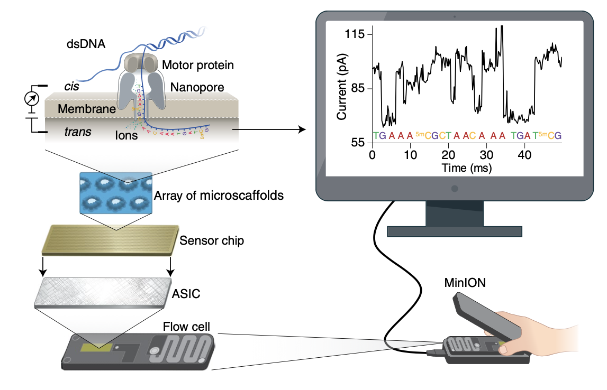
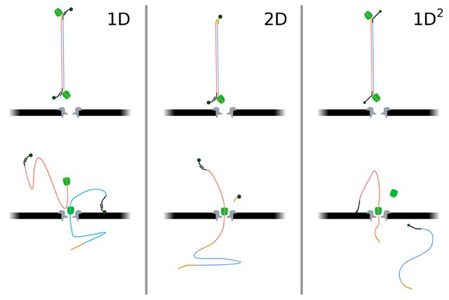
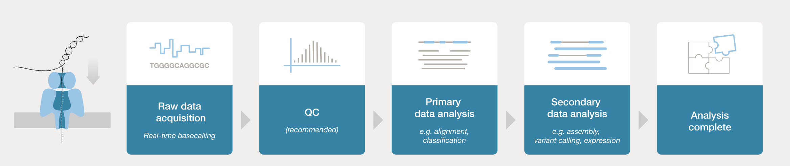
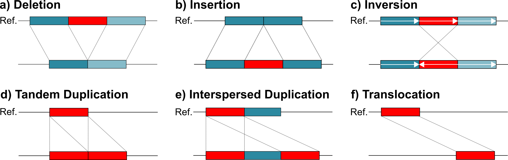
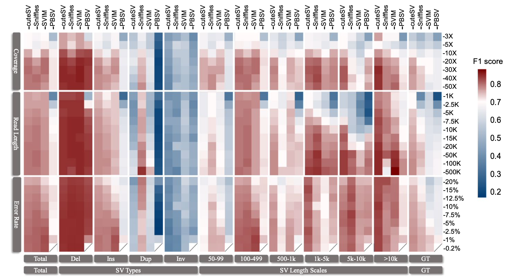

# Nanopore long reads sequencing
Next generation sequencing is currently the gold standard in clinical and research sequencing, and short-reads have proved themself as cost effective and highly accurate (>99.9%).
However, their short fragments size are a limiting factor in mapping efficiency especially for highly homologous and repetitive sequences, homopolymers, and low complexity regions, and makes difficult the identification of Structural Variants (SVs).
For these matters, long read sequencing are more efficient than short ones.
While NGS' read length usually span between 75 up to 600bp, long reads technologies can produce reads up 10kb. 

- [Nanopore long reads sequencing](#nanopore-long-reads-sequencing)
  - [Long reads technologies](#long-reads-technologies)
    - [Oxford Nanopore Technologies’ nanopore sequencing](#oxford-nanopore-technologies-nanopore-sequencing)
  - [Long reads analysis](#long-reads-analysis)
    - [basecalling](#basecalling)
      - [Basecaller tools](#basecaller-tools)
    - [Consensus sequences generation](#consensus-sequences-generation)
      - [Hybrid correction](#hybrid-correction)
      - [Self correction](#self-correction)
    - [*De novo* assembly](#de-novo-assembly)
    - [Alignment to a reference genome](#alignment-to-a-reference-genome)
      - [hg38 and hg19](#hg38-and-hg19)
      - [T2T CHM13](#t2t-chm13)
    - [Splice aware alignment](#splice-aware-alignment)
    - [Phased assembly](#phased-assembly)
    - [Polishing](#polishing)
    - [Variant calling](#variant-calling)
      - [Structural Variants](#structural-variants)
      - [Single Nucleotide Variants](#single-nucleotide-variants)
    - [Trio callers](#trio-callers)

## Long reads technologies 
Two sequencing technologies relying on very different principles share long reads production today: Pacific Biosciences’ (PacBio) single-molecule real-time (SMRT) sequencing and Oxford Nanopore Technologies’ (ONT) nanopore sequencing. Nanopore offers longer read length, higher throughput, and lower costs than PacBio SMRT sequencing as of now.
This document will only focus on bio-informatics methods applied to ONT data, as nanopore sequencing being of interest in the UF.

### Oxford Nanopore Technologies’ nanopore sequencing
ONT allow the sequencing of RNA or DNA single strands without prior amplification step, thus dumping PCR bias during sequencing. This technology doesn't recquire active DNA synthesis, unlike classical sequencing technique and doesn't recquire imaging equipment either.   
Nanopore sequencing measures the ionic current change through a nanopore while a single strand DNA translocates through it. During translocation, changes in current intensity allows to distinguish nucleotides including uraciles, permitting native RNA sequencing with no prior conversion to cDNA. The nanopore sequencing can also detect bases modification such as bases' methylation without any DNA treatment in advance.

During sequencing, the membrane separate two chambers with different electronic potential. 
It's that difference in electronic potential between the two chambers that allow the passing of a single strand DNA or RNA molecule via the nanopores from the upper to the lower chamber. As the sequencing runs, and molecules goes from the top to the bottom chamber, the charge equalises on both sides. Hence, over time a higher current is needed to induce the passing of molecules through the nanopore. Every 2 hours the voltage applied to the flowcell is increased .   
After a while, nanopores get stuck or dies and can't operate anymore. For that matter, the sequencer will switch to a new group of nanopores every 8 hours or so. This can be seen on the [output over experiment time graph from pycoQC](https://rawcdn.githack.com/ziphra/long_reads/24373579089a7ae0b21a6218b2fbc5e90e7d8cac/files/pycoqc.html).

> **Principle of nanopore sequencing.** *A minION flow cell contains 512 channels with 4 nanopores in each channel, for a total of 2,048 nanopores used to sequence DNA or RNA. The wells are inserted into an electrically resistant polymer membrane supported by an array of microscaffolds connected to a sensor chip. each channel associates with a separate electrode in the sensor chip and is controlled and measured individually by the application-specific integration circuit (ASIC). Ionic current passes through the nanopore because a constant voltage is applied across the membrane, where the trans side is positively charged. Under the control of a motor protein, a double-stranded DNA (dsDNA) molecule (or an RNA–DNA hybrid duplex) is first unwound, then single-stranded DNA or RNA with negative charge is ratcheted through the nanopore, driven by the voltage. As nucleotides pass through the nanopore, a characteristic current change is measured and is used to determine the corresponding nucleotide type at ~450 bases per s (R9.4 nanopore).*      
Wang, Yunhao et al. (2021) ‘Nanopore sequencing technology, bioinformatics and applications’, Nature Biotechnology, 39(11), pp. 1348–1365. <https://doi.org/10.1038/s41587-021-01108-x>.

    

> **Schematic overview of the 1D, 2D and 1D 2 sequencing approaches**. *When using 1D chemistry, solely the template strand (blue) is threaded by the motor protein (green). The complement strand (red) is discarded and sequenced. When using the 2D chemistry both the template and complement are sequenced as they are link together with a hairpin (yellow). The 1D 2 chemistry, also allows sequencing of both strands, but rather than linked both strands, the complement strand is tethered to the membrane while the template is sequenced. Subsequently the complement strand is drawn in and the tether is pulled loose. Senne Cornelis* Forensic Lab-on-a-Chip DNA analysis

Here, I will present the main bioinformatics analysis tools for ONT data.

> **Typical long reads workflow** *Analysis solutions for nanopore sequencing data* [Nanopore resource, 03/2022](https://nanoporetech.com/nanopore-sequencing-data-analysis)

## Long reads analysis
The ONT data acquisition and the sequencing read length recquire specific bioinformatic tools to gather accurate information. 

### basecalling 
The first step is to convert current intensity changes measured at the nanopore into bases call.    
The basecaller is the software that translates the raw sequencing data into a nucleotides sequence. 
This step is very critical. Long reads base calling has not been as efficient as in short reads sequencing due to disorderly signals from the nanopore. Indeed, nucleotides being nearby the pore during molecule translocation affect the pore's resistance, impacting the raw signal which can sometimes make signal translation difficult.

For that matter, a lot of tools have been developped by both the machines constructor and the community. 

Even though basecalling can be performed in real time while sequencing, it is often useful to separate the sequencing from basecalling. One advantage of “offline” basecalling is that the basecaller can use significant amounts of compute and read/write resources which may slow the sequencing process and, in rare cases, even lead to loss of sequencing data.

#### Basecaller tools 
Constructor's basecallers are generally the most reliable in terms of stability and accuracy. To date, softwares' constructors seem to be best suited for nanopore basecalling based on popularity and usability.
The two main basecallers developped by ONT remaining under active development today are **Guppy** and **Bonito**. Their goals are slightly different. 

- **Guppy**   
It is the official production basecaller. It is fully supported and documented. It also seems to be slighty more performant than **Bonito**. It is a neural network based basecaller that in addition to basecalling also performs filtering of low quality reads, clipping of Oxford Nanopore adapters and estimation of methylation probabilities per base.

- **Bonito**    
**Bonito** is the open source ONT's basecaller, and figures as a "research and tech demonstrator". It is under active development.  It is GPU focused and you can train Bonito with your own model. If Bonito was said to be slow, its basecalling speeds are now inline with **Guppy** as of December 21.
New features move from Bonito to Guppy. 
Bonito can also perform the alignment with minimap2 if an indexed reference is provided.

- **Dorado**
Dorado is an open-source ONT basecaller. Dorado output nucleotides sequence in unaligned bam output. This format allows to store the nucleotides sequences as well as numerous metadata - such as methylation call.

### Consensus sequences generation

Despite rapid advances in nanopore technologies, long reads still end with a higher base‐level error rate in comparison to short read assembly, mainly due to signal noise during translocation. Thus, long-read accuracy remains challenging. 

To overcome accuracy issues, error-correction can be applied before downstream analysis in order to improve quality results.     

However, it is important that error-correction is not done at the expense of read depth and N50. Some tools may discard or trim reads during the process, negatively impacting downstream analysis.  

Depending on the methodology used, two type of error-correction exists.

#### Hybrid correction 
This type of error-correction tools uses the high accuracy of short-reads (that have error rates usually < 1%) to correct long reads via alignment-based or assembly-based methods. 
The advantage of hybrid correction is that it depends mainly on short reads data. As a result, long reads coverage will not influence the correction whatsoever.
Hybrid correction can improve sequences accuracy to an error rate from 1 to 4%, resulting in an accuracy similar as that of short-reads.    
Hybrid correction can either be alignement-based, or assembly-based.
The first method will align short to long-reads, while the assembly-based methods will first perform an assembly with short reads and then align long reads back to the assembly.  
Within the hybrid methods, assembly-based methods are superior in terms of scalability to large data sets.  
If hybrid methods have been shown to produce more accurate results in general, their performance tend to drop when applied to large and complex genomes.

#### Self correction
One way to auto-correct long-reads is to produce consensus sequences from the set of long reads alone. 
These methods usually results in less accurate reads, with error rates spanning between 3 and 6% which could be a consequence from non random systematic in ONT data.   
Error-correction performance usually increase with sequencing depth.   
Long-reads error-correction recquire high computational power and is relatively slow when perform prior to the reads assembly. Usually, the error prone reads are first assembled and then corrected, but it can also be done before **and** after.

Most current long-reads genome assembly tools include a built-in error-correction stage prior or after the assembly.  
It seems (to me) that error correction before assembly as a seperate software is not that common. It might be the reason why most correcting tools are not under active development, compared to assemblers. However, highly accurate sequences are crucial for exact diagnosis. For that matter, error-correcting tools prior assembly can be of interest. 

### *De novo* assembly
De novo sequence assembly is a theoritical ideal approach as it allows to recreate the original genome sequence through overlapping sequenced reads, but it recquires high coverage, long reads and good quality reads. 

Long-read sequencing technology offers simplified and less ambiguous genome assembly.
Long-reads sequencing lenght allow to reconstruct regions of low complexity or highly repetitive sequences that were barely identifiable with traditional short-reads, based on overlap–layout-consensus algorithms.
That makes long-reads well suited for de novo assembly. 

Currently, *de novo* assemblers perform reads correction before or after assembly. Correction before the assembly is usually slower and recquire higher computational cost. However, error-prone reads assembly can result in assembly errors in the genome sequence, which could impact further downstream analysis. 

For Human genome assembly, Nanopore advises using the third party assembler Shasta. Shasta stores the read in an homopolymer-compressed form using run-length encoding. 
The assembler Canu seems to be widely use and to perfom well on human genomic data, even if it has a very much longer run time. 

One can use QUAST-LG to compare large genome assembly. It accepts sequencing data from multiple platforms and can generate reports with rich assembly metrics as well as plots.

| *De novo* assemblers | Notes                                                                                     |
|--------------------|-------------------------------------------------------------------------------------------|
| Canu               | - Active - Consensus sequence - Trim - Slow - Error correction first - Trio binning assembly - Good contiguity          |
| Falcon             | - Active - Output polished contigs - Error correction first                         |
| MECAT              | - Active - Error correction and assembly tools  - Fast - Error correction first  |
| Miniasm            | Not active                                                                                |
| Flye               | - Error correction after - Active - Recommended by ONT for human data. - Fast, best contiguity and completeness                                                    |
| Wtdbg2             | - Not active - Error correction after                                                  |
| Shasta             | - Good doc - Active - Fastest - Interactive and html reports - No polishing - Recommended by ONT for human data.      |
| Smart denovo       | - No error correction step - Not active - Error correction after                    |
| Raven              | - Active - Polishing stage after  - Error correction - Very fast, lowest memory                                 |

### Alignment to a reference genome
In reference-based assembly, sequenced reads are aligned back to a refernce genome. Even though it can first appear easier than *de novo* assembly, this method has trouble identifying structural variants, and regions that are really different from the reference. 
Using a reference biased towards things that are in the reference and will thus not facilitate new events identification.

Minimap2 seems to be the most recommended long-reads aligner. It is fastest, and more accurate than the majority of other alignment tools.

#### hg38 and hg19 

#### T2T CHM13
The T2T assembly is the most recent and the most complete version of the human genome.
It adds nearly 200 million base pairs of sequence, and correct structural errors.

Imbalence in insertions and deletions have been attributed to missing or incomplete sequences in HG38 as it biases variant calling for insertions.

HG38 has been reconstituted from many genomes and has a mosaic of ancestries, which can lead to an excess of artificial haplotype structure that could bias analysis, as some allelic combination are rare or inexistant.
T2T is mainly from european descent. 

Many of haplotype transitions encountered in 38 are absent from KGP - which seems normal to me as 1KGP is mainly from "non african ancestry", and 38 mainly African.

### Splice aware alignment
As mature RNA misses sequences introns, the alignment to a reference genomes containing introns in between exons becomes challenging. For that matter, "splice-aware" alignment can align RNA seq sequences to a reference genome while being aware to jump out introns regions.  

### Phased assembly 
Global haplotype phasing of human genome is usually performed thanks to parental data. However, in a clinical setting such data are not always available, but fully phased human genome assembly can be accessible without parental data. Strand sequencing (Strand-seq) is a short-read, single-cell sequencing method that preserves structural contiguity of individual homologs in every single cell, and coupled with long-reads technology can achieve high quality completely phased de novo genome assembly.

Phasing converts a 3-Gb collapsed human genome into a 6-Gb genome that represents both maternal and paternal chromosomes, which has the advantage of increasing overall sensitivity for variant discovery.

**Trio binning** is a technique in which the parental genomes are used to parts their offspring genomes in haplotypes specific sets. 

Computational methods can also takes advantage of long reads to resolve a genome's haplotype architecture, and it should overall increase structural variant discovery sensitivity. 

### Polishing 
To remove remaining errors after the assembly, a "polishing step" can be performed. It is an error correcting step done on contigs wether than raw reads in order to increase genome assembly quality and accuracy. It allows for more accurate genomic analyses.
Polishing tools typically compare reads to an assembly to derive a more accurate consensus sequence.

ONT advise to use Medaka coupled with Racon (1 round each).
For a high quality genome assembly, one could also use Medaka after having assembled with Flye. 

| Polishing/error correction  | Notes                                         |
|-----------------------------|-----------------------------------------------|
| Racon + Medaka              | 1 round each after Shasta (ONT)               |
| Medaka                      | After Flye for highly accurate assembly (ONT) |
| Pepper-Margin-DeepVariants  | OG                                            |
| Nanopolish                  |                                               |

### Variant calling 
With a reference genomes, nanopore long-reads can be used to investigate samples' genomic particularities with better accuracy than any other sequencing techniques to date.
While short reads are higly effective in resolving SNV, their short size limit the detection of large structural variants (SVs). 

To asses variant calling, authors often bring up the **F1-score** which is the harmonic **mean of the precision and recall**. The precision is the number of true positive results / by the number of all positive results, including those not identified correctly, and the recall is the number of true positive results / by the number of all samples that should have been identified as positive. F1 score increases logically along with the coverage, read length, and accuracy rate, but the improvement in the ability of SV detection is more important with coverage than read length. However, read length greatly influence deletion, insertion, and duplication calling but not inversion calling. 

20X sequencing depth is sufficient to complete good variant calling with good accuracy. A coverage of 30X to 40X will acheive variant calling with the highest accuracy. 
Concerning the optimal read length, 20 kbp is a promising choice and is sufficiently capable to detect the SVs accurately and sensitively. 
<https://doi.org/10.1186/s12859‐021‐04422‐y>   
Coverage higher than 50X do no good. 

#### Structural Variants
SVs are usually defined as genomic variants larger than 50bps (e.g. deletions, duplications, inversions). Each persons have approximately ~20,000 SV in their genomes, contributing in phenotypes diversity. 

Usually SV callers’ performance varies depending on the SV types.

Mapping uncomformity between sequenced reads and the referance genome allow to detect structural variations:

- A read paired approach allow to determine orientation and distance of events in the genomic sequence.
- The read depth is indicative of a deletion or a duplication event. 
- Split reads are evidence for SVs breakpoint.

No SVs callers use all SVs signature in sequencing. To increase sensivity in SVs detection, it is recommended to use ensemble algorithms, that is algorithms that use 2 or more callers working with different detection methods.

CuteSV is a SVs caller recommended by nanopore for human variant calling. It seems to have a slightly higher accuracy than Sniffles, the other popular tool. 

Pipelines using minimap2-sniffles, minimap2-CuteSV as well as LRA-sniffles and LRA-CuteSV should be compared <https://doi.org/10.1186/s13059-019-1858-1>.

| Structural Variants callers | Notes                                                                         |
|---------------------|-------------------------------------------------------------------------------|
| sniffles            | - Active - Most popular - Performs better with LRA?  - [Finnish SV paper](https://doi.org/10.1038/s41588-021-00865-4)                     |
| cuteSV              | - Active - higher accuracy than Sniffles? - goes well with LRA                                  |
| Svim-asm            | - Does not support multi-threads computing  - Last release and commit in 2021 |
| nanoSV              | - Not under development                                                       |
| Nanovare            | - Active  - Bof    

> **Heatmap of F1 scores for the SV detection performance with various sequencing metrics.**
> Jiang, T., Liu, S., Cao, S. et al. Long-read sequencing settings for efficient structural variation detection based on comprehensive evaluation. BMC Bioinformatics 22, 552 (2021). <https://doi.org/10.1186/s12859-021-04422-y>

#### Single Nucleotide Variants
Identifying SNVs is a challenging task, especially with error prone long reads.

| **SNV**      | **Notes**                                                                                            |
|--------------|------------------------------------------------------------------------------------------------------|
| long shot    | - Only for SNV - Active                                                                           |
| medaka       | - ONT tool - Active - Create consensus sequence                                                |
| deepvariant  | - Google - Active - Part of the PEPPER-Margin-DeepVariant pipeline (polishing+variant calling).  Used in the [Ultra Rapid paper](https://doi.org/10.1038/s41587-022-01221-5) - full alignment based |
| clair3  | Recommended by ONT. Use both pileup and full alignment algorithm |

In long-read variant caller usually used a pile-up or a full alignment algorithm.
With a pileup-based algorithm, the read alignments are summarized into features and counts before being inputted into a variant-calling network. 
A pileup file is a text file that contains one line for each position in the genome, with columns for the reference base, the position, the number of reads that align to that position, the consensus sequence of the reads at that position, and the quality scores for each base.
A pileup format is a way of visualizing the alignment of reads to a specific position in a genome, and it shows the consensus sequence of the reads at that position, as well as any variations from the reference genome.

The full alignment algorithm uses entire aligned sequences and compare the read to the reference.

The pileup based algorithms are usually superior in terms of time efficiency, and the full-alignment algorithms provide the best precision and recall.

Callers are usually trained on raw long read sequences, with no error correction prior. For that matter, error correction before variant calling could lower the calling accuracy, as it is not the type of data the caller was specifically trained on. Also, callers usually create consensus sequences in their calling process. 

### Trio callers
Treating genetic trio analysis as 3 independant tasks limits accurate variant calling.
Few callers can take the familly pedigree in trio or duo analysis to perform more acuurate calling. 
Only Clair3-Trio can do such with ONT data.

