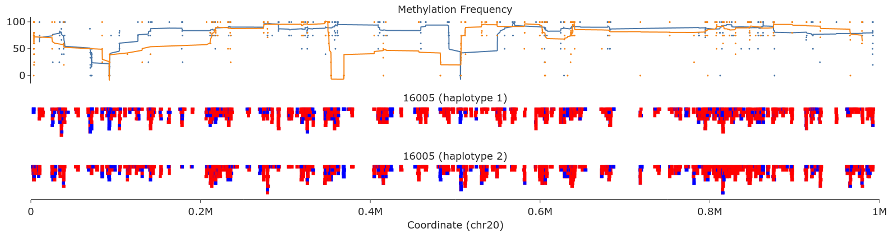
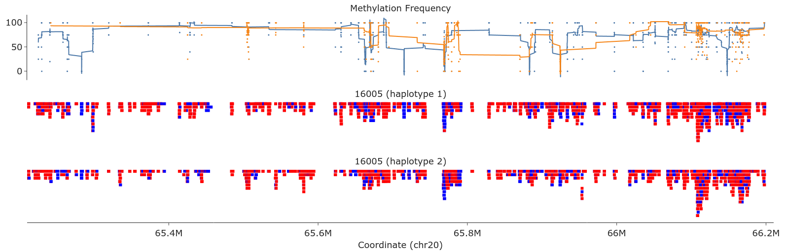

# Ring 20
Chromosome 20 adaptive sampling

## Bioinformatics analysis 
- **Basecalling:** dorado 0.3.1+bb8c5ee
- **Alignement:** minimap2 2.24-r1122 on GRCh38 and chm13v2
- **CNV:** cnvpytor 1.3.1
- **Structural Variants:** Sniffles 2.0.7
- **Small variants:** Clair3 v1.0.4
- **Methylation:** Modkit 0.1.11 

## QC 
| Alignment summary | Reads    | Mean coverage | N50   | Median read length | Median identity freq |
|-------------------|----------|---------------|-------|--------------------|----------------------|
| Hg38 exclusion    | 1.7E+07    | 4.26          | 813 | 777               | 0.990

See [QC, GRCh38 alignment](https://raw.githack.com/ziphra/long_reads/main/ring20/16005_QC_38.html)
See [QC, chm13v2 alignment](https://raw.githack.com/ziphra/long_reads/main/ring20/16005_QC_t2t.html)

## Results
- No adaptive sampling for unknown reasons.
- Poor library quality due to phenol-chloroform DNA extraction.
- Low coverage did not allow copy number profiling or accurate methylation profiling either.

> Methylation frequency in chromosome 20 telomeres and subtelomeric regions. (t2t alignment )

