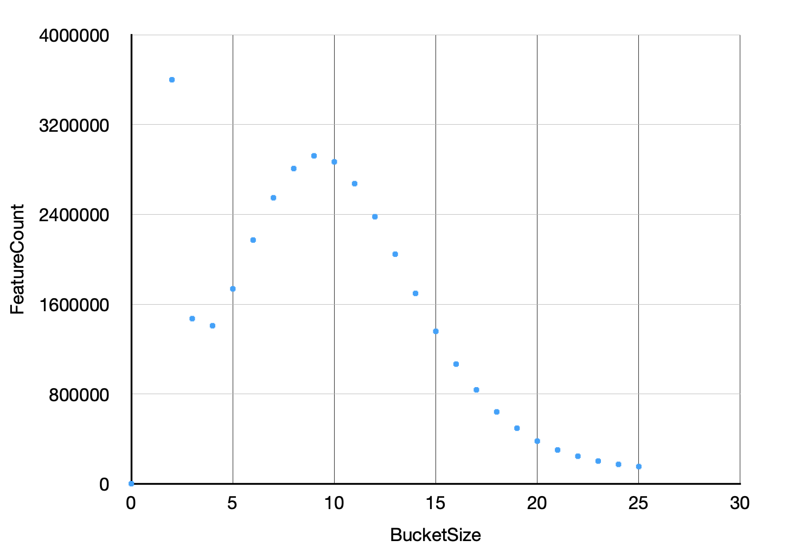

- [Basecalling](#basecalling)
	- [Bonito `0.5.1`](#bonito-051)
		- [Install](#install)
		- [Run Bonito](#run-bonito)
		- [Output](#output)
	- [Guppy](#guppy)
		- [Install](#install-1)
			- [update (guppy 6)](#update-guppy-6)
		- [Run Guppy](#run-guppy)
		- [Setting custom GPU parameters in Guppy](#setting-custom-gpu-parameters-in-guppy)
		- [Output](#output-1)
	- [Dorado Alpha release v.0.0.1](#dorado-alpha-release-v001)
		- [Install](#install-2)
		- [Run Dorado](#run-dorado)
		- [Output](#output-2)
	- [pod5](#pod5)
		- [Install](#install-3)
		- [Run pod5](#run-pod5)
- [Quality check](#quality-check)
	- [FastQC `0.11.9`](#fastqc-0119)
		- [Install](#install-4)
		- [Run FastQC](#run-fastqc)
		- [Output](#output-3)
	- [PycoQC `2.5.2`](#pycoqc-252)
		- [Install](#install-5)
		- [Run PycoQC](#run-pycoqc)
		- [Output](#output-4)
	- [LongQC](#longqc)
		- [Install](#install-6)
		- [Run LongQC](#run-longqc)
		- [Output](#output-5)
	- [MinIONQC](#minionqc)
		- [Install](#install-7)
		- [Run MinIONQC](#run-minionqc)
- [Alignment](#alignment)
	- [minimap2 2.24-r1122](#minimap2-224-r1122)
		- [Install](#install-8)
		- [Run minimap2](#run-minimap2)
			- [Run minimap2 for dorado](#run-minimap2-for-dorado)
	- [LRA 1.3.2](#lra-132)
		- [install](#install-9)
		- [run LRA](#run-lra)
- [Assembly](#assembly)
	- [Shasta](#shasta)
		- [install](#install-10)
		- [Run Shasta](#run-shasta)
		- [Output](#output-6)
		- [Exploring assembly results](#exploring-assembly-results)
		- [Run Shasta on low X mode](#run-shasta-on-low-x-mode)
		- [Run Shasta with "short" long-reads](#run-shasta-with-short-long-reads)
		- [God's MinION run (low X and short reads)](#gods-minion-run-low-x-and-short-reads)
	- [Canu](#canu)
		- [Install](#install-11)
		- [Run Canu](#run-canu)
		- [output](#output-7)
	- [Flye](#flye)
		- [install](#install-12)
		- [Run Flye](#run-flye)
- [Polishing](#polishing)
	- [Medaka](#medaka)
		- [Install](#install-13)
		- [Run Medaka](#run-medaka)
- [Assembly quality assesment](#assembly-quality-assesment)
	- [Pomoxis](#pomoxis)
		- [Install](#install-14)
		- [Run Pomoxis](#run-pomoxis)
	- [QuastLG](#quastlg)
		- [Install](#install-15)
		- [Run QuastLG](#run-quastlg)
	- [Inspector](#inspector)
		- [Install](#install-16)
		- [Run Inspector](#run-inspector)
		- [Output](#output-8)
	- [Assembly on a specific region](#assembly-on-a-specific-region)
		- [retrieve a specific regions out of a bam file](#retrieve-a-specific-regions-out-of-a-bam-file)
		- [retrieve ref's specific regions in `.fasta`](#retrieve-refs-specific-regions-in-fasta)
- [Variant calling](#variant-calling)
	- [SNP calling](#snp-calling)
		- [PEPPER-Margin-Deep Variant workflow](#pepper-margin-deep-variant-workflow)
			- [PEPPER SNP](#pepper-snp)
			- [Margin](#margin)
			- [PEPPER HP](#pepper-hp)
			- [DeepVariant](#deepvariant)
		- [Install](#install-17)
			- [Run PEPPER-Margin-Deep Variant workflow](#run-pepper-margin-deep-variant-workflow)
			- [Output](#output-9)
		- [clair3](#clair3)
			- [Install](#install-18)
			- [Run clair3](#run-clair3)
				- [SwitchZygosityBasedOnSVCalls module](#switchzygositybasedonsvcalls-module)
		- [Output](#output-10)
	- [Structural variants calling](#structural-variants-calling)
		- [Sniffles](#sniffles)
			- [Install](#install-19)
			- [Run Sniffles](#run-sniffles)
			- [Run Sniffles on low depth data](#run-sniffles-on-low-depth-data)
			- [Ouput](#ouput)
		- [CuteSV](#cutesv)
			- [installation](#installation)
			- [Run CuteSV](#run-cutesv)
- [Variants benchmarking](#variants-benchmarking)
	- [Benchmarcking resources: Genome in a Bottle](#benchmarcking-resources-genome-in-a-bottle)
		- [Small variants truth set](#small-variants-truth-set)
		- [SV truth set](#sv-truth-set)
			- [NIST SVs Integration_v0.6](#nist-svs-integration_v06)
			- [GIAB Challenging Medically Relevant Gene Benchmark](#giab-challenging-medically-relevant-gene-benchmark)
	- [truvari](#truvari)
		- [Install](#install-20)
		- [Run truvari](#run-truvari)
	- [hap.py](#happy)
		- [Run `hap.py`](#run-happy)
		- [Output](#output-11)
- [Variants annotation](#variants-annotation)
	- [vt](#vt)
		- [install](#install-21)
	- [VEP](#vep)
		- [install](#install-22)
	- [ANNOTSV](#annotsv)
		- [install](#install-23)
		- [Run ANNOTSV](#run-annotsv)
			- [custom annotation with ANNOTSV](#custom-annotation-with-annotsv)
		- [Output](#output-12)
		- [KnotAnnotSV](#knotannotsv)
			- [Install](#install-24)
	- [Snpeff & SnpSift](#snpeff--snpsift)
		- [Install](#install-25)
		- [Run Snpeff](#run-snpeff)
	- [ANNOVAR](#annovar)
		- [Install ANNOVAR](#install-annovar)
	- [Run Annovar](#run-annovar)
	- [MAVIS](#mavis)
		- [Install MAVIS](#install-mavis)
		- [Run MAVIS annotation only](#run-mavis-annotation-only)
- [Annotations](#annotations)
	- [OMIM](#omim)
		- [custom OMIM](#custom-omim)
	- [DGV](#dgv)
		- [custom DGV](#custom-dgv)
	- [Clinvar](#clinvar)
	- [HGMD](#hgmd)
	- [sysnnd](#sysnnd)
		- [custom sysndd](#custom-sysndd)
	- [gnomAD](#gnomad)
- [Handling a VCF](#handling-a-vcf)
	- [GATK](#gatk)
		- [Install](#install-26)
		- [liftoverVCF](#liftovervcf)
	- [vcflib - subset VCF](#vcflib---subset-vcf)
		- [install](#install-27)
		- [Run vcflib](#run-vcflib)
		- [randomly subset a vcf](#randomly-subset-a-vcf)
	- [filter VCFs with `bcftools`](#filter-vcfs-with-bcftools)
	- [Transfer/custom VCF annotation - an example](#transfercustom-vcf-annotation---an-example)
	- [Hail](#hail)
		- [Variant dataset](#variant-dataset)
- [Miscellaneous](#miscellaneous)
	- [liftOver UCSC](#liftover-ucsc)
		- [install](#install-28)
	- [retrieve a specific regions out of a bam file](#retrieve-a-specific-regions-out-of-a-bam-file-1)
	- [retrieve reference's specific region in `.fasta`](#retrieve-references-specific-region-in-fasta)
	- [Add MD tags to .`bam`](#add-md-tags-to-bam)
	- [sam flags](#sam-flags)
	- [reads with `MAPQ==0`](#reads-with-mapq0)
	- [HyperExome regions > 30X](#hyperexome-regions--30x)
	- [`samtools depth`](#samtools-depth)
	- [akt - ancestry and kinship toolkit](#akt---ancestry-and-kinship-toolkit)
		- [install](#install-29)
- [Computing issue](#computing-issue)
		- [convert file encoding](#convert-file-encoding)
		- [install R](#install-r)


# Basecalling
## [Bonito](https://github.com/nanoporetech/bonito) `0.5.1`
### Install
```
conda install pip
pip install --upgrade -pip
pip install ont-bonito
pip install -f https://download.pytorch.org/whl/torch_stable.html ont-bonito-cuda111 #dowload files for CUDA 11.1 - alienware is under CUDA 11.2
bonito download --models #load basecalling models
cp /media/god/DATA/reference_genome/hg38/hg38_GenDev.fa /home/euphrasie/DATA # indexed ref genome 
```
### Run Bonito


- To ouput **aligned `.bam`**:   
Bonito will perform reads alignment if an indexed reference is provided.

```
# dna_r10.4_e8.1_***@v3.4 = training set
# -- reference = indexed reference genome with minimap2 - .mmi file

bonito basecaller dna_r9.4.1_e8.1_hac@v3.3 --reference hg38_GenDev.mmi data/ > bonito/bam/basecalls.bam
```

- To ouput **unaligned `.fastq`**:

```
bonito basecaller dna_r9.4.1_e8.1_hac@v3.3 data/ > bonito/fastq/basecalls.fastq
```
Use the training set `dna_rXX.X_e8.X_hc@vX.X` according to flowcells' nanopore (RXX.X) and library preparation (e8.X).   
*notes:* no `/` before the reads folder, otherwise no reads will be processed...   

### Output
`.bam` ouptputs:

- a bam file 
- a basecalls_summary.tsv

`.fastq` outputs:

- a fastq file
- basecalls_summary.tsv


## [Guppy](https://community.nanoporetech.com/knowledge/bioinformatics/tools) 
Guppy is the official ONT basecaller. As bonito, it can output `.bam` files. 

### Install 
See ONT [doc](https://community.nanoporetech.com/docs/prepare/library_prep_protocols/Guppy-protocol/v/gpb_2003_v1_revac_14dec2018).
Guppy was already installed, but needed an update.      
```
sudo apt install ont-guppy
```
#### update (guppy 6)
```
sudo apt update
sudo apt upgrade ont-guppy 
```

### Run Guppy 
See [Jetson Xavier basecalling notes](https://gist.github.com/sirselim/2ebe2807112fae93809aa18f096dbb94), and [Guppy GPU benchmarking by Miles Benton](https://esr-nz.github.io/gpu_basecalling_testing/gpu_benchmarking.html#cfg_files)

```
guppy_basecaller \
-i ./data \
-s ./guppy_output \
--records_per_fastq 0 \
--disable_qscore_filtering \
-r \
-c dna_r9.4.1_450bps_hac.cfg \
--device 'auto' \
--compress_fastq \
--num_callers 16 \
--chunk_size 1000 \
--gpu_runners_per_device 4 \
--chunks_per_runner 512 \
--disable_pings \
```

- `--records_per_fastq`: 1- only a single read will be output per file; 0- all reads will be written into a single file. 
- `-c dna_r9.4.1_450bps_hac.cfg` available flowcell + kit combinations, `hac` = high accuracy, `sup` = super high accuracy. To see the models available: `guppy_basecaller --print_workflows`. Do not forget to add `.cfg` after the model's name! 
- `-a` optional reference file name. Alignment is performed with minimap2.
--device 0 
- `-r` search trough all subfolders for fast5 
- `--compress_fastq` compress fastq output files with gzip. Highly reduce processing time 
- `--num_callers` = threads.
- `--chunks_per_caller` directly influences how much computation can be done in parallel by a single basecaller
- `--chunks_per_runner` The maximum number of chunks which can be submitted to a single neural network runner before it starts computation. Increasing this figure will increase GPU basecalling performance when it is enabled. 
- `--disable_pings `: disable sending any telemetyry information to ONT.

### Setting custom GPU parameters in Guppy

Follow this calculation to estimate custom GPU parameters in Guppy: 

memory used by Guppy [in bytes] ≈ `gpu_runners_per_device` * `chunks_per_runner` * `chunk_size` * model_factor 

Where model_factor depends on the basecall model used:

| Basecall model | model_factor | 
|----------------|--------------|
| Fast           | 1200         |
| HAC            | 3300         |
| SUP            | 12600        |

For best performance it is recommended that the memory allocated should not exceed half the total GPU memory available. If this value is more than the available GPU memory, Guppy will exit with an error.

As the alienware features 64GB of RAM, we would like:    
**`gpu_runners_per_device` x 512 x 1000 x 12600 ≈ 32.10^9**        
Which estimates `gpu_runners_per_device` at **4**.

`chunks_per_runner` and `chunk_size` were estimated from others run. Before running, it is important to make sure that the GPU can fit at least one runner. For speed matter, it can be best to have a dozen runners or more.


### Output 
- A log file
- sequencing_summary.txt
- fastq or bam depending if there were an optional alignment step. Output might be separated into `pass`, `fail`, and `calibration_strands` folders depending on wether they pass or fail the filtering condition. For faster models, the filtering score is 7 (~85% accuracy) but is higher for more accurate models.
- what is the `dump-dp` folder for?

## Dorado Alpha release v.0.0.1

### Install
Simply download linux package. Link on the readme.

### Run Dorado 
- download a model: `dorado download --model dna_r9.4.1_e8_sup@v3.3` doesn't work, but one can `wget` the requested model folder with `wget https://nanoporetech.box.com/shared/static/g6rbgd12xfunw5plgec3zlyy35692vy3.zip`. Models' paths can be found [here](https://github.com/nanoporetech/dorado/blob/master/dorado/models.h).

```

```

### Output
Dorado doesn't output `fastq`, as we could expect, but unaligned `sam`.
`sam` can store more information than `fastq`, that only store sequence ID, sequence itself, and quality scores for each nucleotides. 
Originally, `sam` are used to store mapping information. A `bam` is smaller than a `fastq.gz` containing exactly the same information.
Also, `sam` allows to store metadata. 

**size (GB) according to file type:**       
| fastq | fastq.gz | sam | bam |
|-------|----------|-----|-----|
| 80    | 39       | 63  | 28  |   

Dorado took 19 hours to basecalled `PromethionGenDev_Test4_13062022_analysis` data .

** basecalled `sam` metadata**


## [pod5](https://github.com/nanoporetech/pod5-file-format)
pod5 is ONT new format for its raw sequencing data. It replaces fast5 and has smaller size and improves read/write performance. ONT has developped a python library and a set of tools for pod5. Dorado, ONT' latest basecaller at the time writing, uses pod5 for best performances.

### Install 
To use ONT's [selection of tools](https://github.com/nanoporetech/pod5-file-format/blob/master/python/README.md) for pod5:

```
pip install pod5_format_tools
```
Reduces file size to 30%.

**size (GB) according to file type:**       
| pod5 | fast5 |
|------|-------|
| 344  |   422 |  

### Run pod5
From `fast5` to `pod5`
```
pod5-convert-from-fast5 fast5/* pod5/
```


# Quality check 
## [FastQC](https://www.bioinformatics.babraham.ac.uk/projects/fastqc/) `0.11.9`
FastQC performs the quality control of raw fastq files. It identifies biases in base composition, read duplication, base quality, read length etc.  
Originally made for NGS data, it has not been fully optimized for long reads.   
Can work recursively, and on compressed fastq.

### Install   
`sudo apt install fastqc`  

### Run FastQC 
`fastqc -o ./data/output_quality_raw/ ./data/test_data.fastq`

### Output 

It provides an htlm document in which to inspect the output, and contains: 

- **Basic stats**
- **Per base sequence quality**: Often, the reads quality deteriorates during later cycles.
- **Quality per tile**: Encoded in these is the flowcell tile from which each read came. The graph allows to look at the quality scores from each tile across all of your bases to see if there was a loss in quality associated with only one part of the flowcell.
- **Per sequence quality scores**
- **Base composition plots**
- **GC content**
- **Duplication levels and over-represented sequences**: Indicate PCR primers, sequencing adapters, multiplexing barcodes etc that are still contained in the data and will have to be trimmed/removed.


## [PycoQC](https://github.com/a-slide/pycoQC) `2.5.2`
Computes metrics and generates interactive QC plots for ONT.

### Install 
```
conda create -n pycoQC python=3.6
conda activate pycoQC
conda install -c aleg -c anaconda -c bioconda -c conda-forge pycoQC=2.5.2
```

### Run PycoQC
PycoQC relies on the `sequencing_summary.txt` file generated by basecallers but can also generate a summary file from basecalled fast5 files.


``` 
pycoQC -f basecalled_summary.tsv -a file.bam -o basecalled.html
```

- `f`: `sequencing-summary.txt` from the basecaller 
- `a`: `file.bam` corresponding to reads in the basecalling summary. Optional. If given then alignment QC will be added.


### Output 
See [output file](https://rawcdn.githack.com/ziphra/long_reads/24373579089a7ae0b21a6218b2fbc5e90e7d8cac/files/pycoqc.html). Besides basic reads statistics, PycoQC also provide information on the sequencing run and the flowcell itself such as yield over time, number of active pores etc. Plots are interactive and customizable.


## [LongQC](https://github.com/yfukasawa/LongQC)
Don't work with compress fastq. Don't work recursivly. 
Another quality tool for long reads. It has 2 functionalities:
 
- Sample QC: this accepts standard sequence file formats, Fastq, Fasta and subread BAM from PacBio sequencers, and users can check whether their data are ready to analysis or not. You don't need any reference, meta information, even quality score.
- Platform QC: this extracts and provides very fundamental stats for a run such as length or productivity in PacBio and some plots for productivity check for ONT.

### Install
```
git clone https://github.com/yfukasawa/LongQC.git
cd LongQC/minimap2-coverage && make
```
Worked with `pyhton 3.8`. Had to install few missing libraries. 

To make `LongQC.py` executable from anywhere:  

1. `gedit ~/.bashrc`
2. Type in `.bashrc` `alias longqc="python /<dir_where_file_is_located>/longqc.py"` and save
3. `source .bashrc`

### Run LongQC 
`longqc sampleqc -x ont-ligation -o out_dir input_reads.fq`

### Output
See [output file](https://htmlpreview.github.io/?https://github.com/ziphra/long_reads/blob/main/files/longqc.html)


## [MinIONQC](https://github.com/roblanf/minion_qc)
MinIONQC is a quality control tool for MinION and PromethION sequencing data. In comparison to PycoQC it is able to compare multiple sequencing runs, e.g., to compare different library preparation or DNA extraction protocols used.

### Install 
```
wget https://raw.githubusercontent.com/roblanf/minion_qc/master/MinIONQC.R -O MinIONQC.R
wget https://github.com/roblanf/minion_qc/archive/refs/tags/1.4.2.zip
sudo apt install r-base-core
```
`alias minionqc = "Rscript '/home/euphrasie/bioprog/MinIONQC.R'"`

### Run MinIONQC
```
MinIONQC.R -i path/to/sequencing_summary.txt # or path/to/parent_directory
```


# Alignment 
## [minimap2 2.24-r1122](https://github.com/lh3/minimap2)
Does not produce consensus sequence. 
### Install 
```
git clone https://github.com/lh3/minimap2
cd minimap2 && make
```

### Run minimap2 

- index:    
```
minimap2 -x map-ont hg38.fa -d ref.mmi 
```
- alignment: 
```
minimap2 -t 10 -ax map-ont hg38.mmi ../fastq/basecalled.fastq | samtools sort -@ 8 -o minimap2_alignment.bam
```

	- `t`: number of threads 
	- `a`: outputs SAM
	- `x`: presets. `map-ont` is for aligning noisy long reads of ~10% error rate to a ref genome. Default mode.
	- `splice`: splice aware alignment mode.
	- The pipe `|` allows to directly write the outputs as `BAM`, and not as `SAM` (or `.paf` in default mode). 
	- `@`: number of threads 
	- `MD` MD tag is for SNP/indels calling without looking at the reference.

minimap2 produces `.sam` (Sequence Alignment and Map) files. `samtools` allows to convert to `bam` sorted files, its binary format. 
	

#### Run minimap2 for dorado 

```
bedtools bamtofastq -i  dorado.bam -fq dorado.fastq | minimap2 -t 10 -ax map-ont hg38.mmi - | samtools sort -@ 8 -o minimap2_alignment.bam
```

## [LRA 1.3.2](https://github.com/ChaissonLab/LRA)
### install 
From source, build in a `conda env` with `zlib` and `htslib` installed:  

```
wget https://github.com/ChaissonLab/LRA/archive/refs/tags/v1.3.3.tar.gz
tar -xvf v1.3.3.tar.gz
cd LRA-1.3.3/
make
```

### run LRA 
- index:    
`/home/euphrasie/bioprog/LRA-1.3.3/lra index -ONT /media/god/DATA/reference_genome/hg38/hg38_GenDev.fa`   
Indexs will be stored in the **same directory where the ref.fa is stored!** 
- alignment:    
`/home/euphrasie/bioprog/LRA-1.3.3/lra align -ONT -t 10 /media/god/DATA/reference_genome/hg38/hg38_GenDev.fa ../fastq/basecalled.fastq -p s | samtools sort -@ 4 -o lra.bam`
	- `-t`: threads
	- `-ONT`
	- `-p`: output parameter, `-p s` = sam output.


# Assembly
## [Shasta](https://github.com/chanzuckerberg/shasta)
<https://chanzuckerberg.github.io/shasta/>
### install 

```
curl -O -L https://github.com/chanzuckerberg/shasta/releases/download/0.8.0/shasta-Linux-0.8.0
sudo chmod ugo+x shasta-Linux-0.8.0
```

### Run Shasta

```
shasta \
--input input.fastq \
--config Nanopore-Phased-Jan2022 \
--thread 16 \
--memoryMode filesystem --memoryBacking disk \
--Assembly.mode 0 \
--Reads.minReadLength 5000
```

- To see all configuration available: `shasta --command listConfigurations` 
- To have information on one conf: `shasta --command listConfiguration --config Nanopore-Oct2021`
- `--memoryBacking`: Shasta assembler operates with no access to data on disk except during initial input of the reads, the final output of the assembly, and for small output files. As a result, for optimal performance, Shasta memory requirements are higher than comparable tools that keep some or most of their data on disk. For a human-size genome (≈3 Gb) at coverage 60x, this works out to around 1 TB of memory.
	- `--memoryBacking 2M` if 1TB memory available. 
	- `--memoryBacking disk`: The alienware has 64GB of memory, which is too small for a human genome. Shasta can operate with data structures physically on disk or other storage systems with `--memoryBacking disk`, mapped to virtual memory, but this results in huge performance penalty. However, SSD disks allow the operation to run faster.
- `--memoryMode filesystem` to allow  `--memoryBacking disk`
- `--thread 16`: default number of threads = number of core processor 
- `--Reads.minReadLength`: default value = 10000, see QC to determine this.
- `--Assembly.mode 2`: Assembly mode (0 = haploid assembly, 2 = phased diploid assembly).
- `--alignmentsPafFile alignment.paf`: experimental. Could be great for structure variants?
- `--command explore`: starts Shasta in a mode that behaves as an http server. Allow a browser to connect to it and visualize detailed information about bthe assembly, and this requires the binary data for the assembly to be available.

When done using binary data, `shasta --command cleanupBinaryData`

### Output
- `Assembly.fasta`: The assembly results in FASTA format. The id of each assembled segment is the same as the edge id of the corresponding edge in the assembly graph.
- `Assembly.gfa`: The assembly results in GFA 1.0 format. This contains the same sequences in the FASTA file (as GFA segments), plus their connectivity information (as GFA links). A convenient tool to inspect and study these files is Bandage. Segment ids in the GFA file correspond to FASTA ids in the FASTA file and also to assembly graph edge ids.
- `Assembly-BothStrands.gfa`: An alternative GFA output file for the assembly. This contains both strands of the assembly. This can be useful in some cases to clarify connectivity of assembled segments. See AssemblySummary.csv to find the id of the reverse complement of each assembled segment.
- `AssemblySummary.html`: An html file summarizing many assembly metrics. It can be viewed using an Internet browser. It has the same content shown by the summary page of the Shasta http server (`--command explore`).
- `shasta.conf`: a configuration file containing the values of all assembly parameters used. This file uses a format that can also be used as input for a subsequent Shasta run using option `--config`.
- `ReadLengthHistogram.csv`: A spreadsheet file containing statistics of the read length distribution. This only includes reads that were used by the assembler. The assembler discards reads shorter than  `Reads.minReadLength` bases **(default 10000)** and reads that contain bases repeated more than 255 times. The fifth field of the last line of this file contains the total number of input bases used by the assembler in this run.
- `Binned-ReadLengthHistogram.csv`: Similar to `ReadLengthHistogram.csv`, but using 1 Kb bins of read lengths.
-`Data`: A directory containing binary data that can later be used by the Shasta http server or with the Shasta Python API. This is only created if option `--memoryMode filesystem` was used for the run. Keep in mind that, unless you used option `--memoryBacking disk`, these data are in memory, not on disk, and will disappear at next reboot. If you want to save them permanently, you can use script `shasta-install/bin/SaveRun.py` to create a copy on disk of the binary data directory named `DataOnDisk`.

### Exploring assembly results
- Install graphviz : `sudo apt install graphviz`
- Run the assembler again, this time specifying option `--command explore`, plus the same `--assemblyDirectory` option used for the assembly run (default is `ShastaRun`)

### Run Shasta on low X mode

See shasta's [issues](https://github.com/chanzuckerberg/shasta/issues/7)

List of parameters for which the optimal value may be dependant on coverage: 

- `MinHash.maxBucketSize` 
- `MarkerGraph.minCoverage` 
- `MarkerGraph.maxCoverage` 
- `MarkerGraph.lowCoverageThreshold` 
- `MarkerGraph.edgeMarkerSkipThreshold` 
  
The parameters above may be dependant on coverage and could be scale proportionaly to depth, as advised for very low stringent coverage. 


- `MinHash.minHashIterationCount` ↗️ from default (10) to 20 or 50
- `MinHash.minFrequency` ↘️ from 2 to 1
- `Align.minAlignedMarkerCount` ↘️ from 100 to 50 

Concerning low hash algorithms and tweaking of `MinHash.maxBucketSize` and `MinHash.minBucketSize` ([#289](https://github.com/chanzuckerberg/shasta/issues/289) and [#285](https://github.com/chanzuckerberg/shasta/issues/285)): 
`LowHashBucketHistogram.csv` allows to determine their optimal values by plotting FeatureCount versus BucketSize. 


> `--MinHash.minBucketSize` and `MinHash.maxBucketSize` should probably be set between 5 and 15 for this data.


### Run Shasta with "short" long-reads

See shasta's [issues](https://github.com/chanzuckerberg/shasta/issues/250)

- `Reads.minReadLength` ↘️
- `Align.minAlignedMarkerCount`: the more we ↘️ this parameter, the more you ↗️ the possibility of incorrect assembly errors.

### God's MinION run (low X and short reads)

```
shasta \
--input input.fastq \
--config Nanopore-Oct2021 \
--thread 16 \
--memoryMode filesystem \
--memoryBacking disk \
--Assembly.mode 0 \
--Align.minAlignedMarkerCount 50 \ #100
--MinHash.maxBucketSize 4 \ #default: 10 
--MarkerGraph.minCoverage 2 \ #10
--MarkerGraph.maxCoverage 10 \ #100
--MarkerGraph.lowCoverageThreshold 0 \ #0 
--MarkerGraph.edgeMarkerSkipThreshold 10 \ #100
--MinHash.minHashIterationCount 50 \ #10
--MinHash.minFrequency 1 \ #2
--Reads.minReadLength 2000 \
```

## [Canu](https://canu.readthedocs.io/en/latest/tutorial.html)
### Install 
```
curl -L https://github.com/marbl/canu/releases/download/v2.2/canu-2.2.Linux-amd64.tar.xz --output canu-2.2.Linux.tar.xz 
tar -xJf canu-2.2.*.tar.xz
```

### Run Canu 
The `canu` command will execute all the assembly steps, from correction, trimming and eventually unitigs construction.   
`batMemory` and `batThreads` were recquired for some reason, so Canu doesn't crash, even though `maxMemory` and `maxThreads` should be default value. 

```
  ./bin/canu \
 -p canu2 -d /home/euphrasie/Documents/lr_test3/canu \
 genomeSize=3g maxInputCoverage=100 \
 -nanopore /home/euphrasie/Documents/lr_test3/fastq/basecalled.fastq \
 minInputCoverage=3 \
 -maxMemory=50 -maxThreads=16 -batMemory=50 -batThreads=16
```

- `genomeSize`: the genome size estimate is used to decide how many reads to correct and how sensitive the mhap overlapper should be (via the mhapSensitivity parameter). It also impacts some logging, in particular, reports of NG50 sizes.
- `maxInputCoverage`
- `minInputCoverage`: low data=low coverage. To estimate coverage: `(read_count x read_lenght) / Gn size`. The average coverage on god minion data was ~4,3


### output
Way too long

## [Flye](https://github.com/fenderglass/Flye)
### install 
```
conda create -n flye -c conda-forge -c bioconda flye=2.9
```
### Run Flye
Mammalian assemblies with 40x coverage need ~450Gb of RAM (for ONT) and typically finishes within 3-4 days using 30 threads.
`--asm-coverage` option can be used to reduce the memory usage by sampling the longest reads for the initial disjointig assembly.
Typically, 40x longest reads is enough to produce good disjointigs. Regardless of this parameter, all reads will be used at the later pipeline stages.

```
conda activate flye 
flye --nano-hq /media/eservant/Data1/euphrasie/HG002_PAG07506/HG002_PAG07506.fastq.gz -o /media/eservant/Data1/euphrasie/HG002_PAG07506/flye2 -g 2.9g --asm-coverage 8 -t 44
```

# Polishing
## [Medaka](https://github.com/nanoporetech/medaka)
Medaka is a polishing tool developped by ONT. 
It was often use together with the other polishing tool Racon, but Racon was not updated since 2019 and it seems that there is no difference between assemblies polished with Racon x Medaka and Medaka alone. 
### Install 
By installing from source, dependencies are resolved and it enables the use of GPU resource.

```
# Note: certain files are stored in git-lfs, https://git-lfs.github.com/,
#       which must therefore be installed first.
sudo apt install git-lfs

git clone https://github.com/nanoporetech/medaka.git
cd medaka
make install
. ./venv/bin/activate
```

### Run Medaka 
```
medaka_consensus -i /home/euphrasie/Documents/HG002_PAG07506/HG002_PAG07506.fastq -d /media/euphrasie/DATA/ShastaRun1/Assembly.fasta -o medakaa_shasta1 -t 16 -m r941_prom_hac_g507
```

# Assembly quality assesment
## [Pomoxis](https://nanoporetech.github.io/pomoxis/programs.html#assess-assembly)
Pomoxis can be used to do basics operations on assemblies and compute basics assemblies stats. 

### Install 
```
conda create --name pomoxis
conda activate pomoxis
conda install pomoxis
```

### Run Pomoxis
- **`coverage_from_bam`**  
  Calculate read coverage depth from a bam. Can be run on specific regions. Output a depth summary. 
- **`assess_assembly`**  
  calculate accurate stats for an assembly: percentage errors, Q scores, and reference coverage


## QuastLG
For evaluating large-scale genome assemblies 
### Install 
```
wget https://downloads.sourceforge.net/project/quast/quast-5.0.2.tar.gz
tar -xzf quast-5.0.2.tar.gz
cd quast-5.0.2

./setup.py install_full
```

Replace all occurences of `cgi` with `html` in `quast_libs/site_packages/jsontemplate/jsontemplate.py`.

`Quast` install is not working in all `python` and `Quast` versions tried. It seems that there is a problem related with `joblib`. Supposed to work with one thread. 

### Run QuastLG


## [Inspector](https://github.com/ChongLab/Inspector) 

### Install 
`Inspector` works in conda `base` env. 

- `git clone https://github.com/ChongLab/Inspector.git`
- duplicate the executable `inspector.py` to `inspector2.py` 
  - change the 2 occurences of '`minimap2`' with full `minimap2` path.
  - add the missing parentheses where `SyntaxError` occurs when ran `inspector2.py`
  - `pip install pysam` 

and then, 
- `vim ~/.bashrc` to add `alias inspector='/path/inspector2.py'`
- `source ~/.bashrc`

### Run Inspector
`Inspector` is a tool for assembly evaluation with long read data. 
```
inspector \
	-c ShastaRun/Assembly.fasta \
	-r data.fastq \
	--ref ref.fa \
	-o ins2/ \
	-d nanopore
```

### Output 
- `summary_statistics`: An assembly with expected total length, high read-to-contig mapping rate, low number of structural and small-scale errors, and high QV score indicates a high assembly quality. When the reference genome is provided, a higher genome coverage and N50 also indicates more complete assembly.
- `structural_error.bed` and `small_scale_error.bed`: they are identified from read-to-contig alignment and distinguished from genetic variants based on the ratio of error-containing reads

- some plots 
- `read_to_contig.bam` and `.bai`: allows downstream assembly evaluation such as contig continuity and completeness
- `contig_to_ref.bam` and `.bai` if a `ref.fa` is provided
- `valid_contig.fa` and `.fai
  `

## Assembly on a specific region
### retrieve a specific regions out of a bam file 
- `samtools view -b minimap2MD.bam chr11 > in_chr11.bam`
- `bedtools bamtofastq -i in_chr11.bam -fq chr11.fastq` 

### retrieve ref's specific regions in `.fasta`
- `samtools faidx ref.fa -r chr11.txt -o ref_chr11.fa`    
with `chr11.txt` a file with regions of interest coordinates formatted as:    
`chr11:from-to`, one per line. 


# Variant calling
## SNP calling 
### [PEPPER-Margin-Deep Variant workflow](https://github.com/kishwarshafin/pepper)
#### PEPPER SNP
This finds SNPs from a read-to-reference alignment file using a recurrent neural network. Reports potential SNP sites using the likelihood of observing alternative alleles

#### Margin
Hidden Markov model-based, haplotyping module that produces a haplotag for each read using the SNPs reported by PEPPER SNP. Polishing step.

#### PEPPER HP
Takes the haplotagged alignment file from Margin and produces a set of candidate variants.

#### DeepVariant
Produces the final genotype calls by using a convolutional neural network with the candidates from PEPPER HP

### Install 
see <https://github.com/kishwarshafin/pepper/blob/r0.8/docs/quickstart/variant_calling_docker_gpu_quickstart.md>.    
Followed instruction to install nvidia-docker, but `sudo docker run --rm --gpus all nvidia/cuda:11.0-base nvidia-smi` or any attempt in docker pulling would result in
 
```
unable to find image 'XXX' locally
docker: Error response from daemon: Get "https://registry-1.docker.io/v2/" ....
```
To troubleshoot that: 

- `sudo vim /etc/systemd/system/docker.service.d/http-proxy.conf` 
Create the directory architecture if it is missing.
- Then `i` to modify the file, and write:

```
[Service]
Environment="HTTP_PROXY=http://proxym-inter.aphp.fr:8080"
Environment="HTTPS_PROXY=http://proxym-inter.aphp.fr:8080"
Environment="NO_PROXY=hostname.example.com, 172.10.10.10"
``` 

- then, 
 
```
sudo systemctl daemon-reload
sudo systemctl restart docker
```

- `docker pull hello-world` should now work, and other dockers installation can be performed. 

#### Run PEPPER-Margin-Deep Variant workflow

```
BASE="`pwd`"

# Set up input data
INPUT_DIR="${BASE}/input/data"
REF="hg38_GenDev.fa"
BAM="minimap2_alignment.bam"

# Set the number of CPUs to use
THREADS="14"

# Set up output directory
OUTPUT_DIR="${BASE}/output"
OUTPUT_PREFIX="god_pmdv"
OUTPUT_VCF="god_pmdv.vcf.gz"

## Create local directory structure
mkdir -p "${OUTPUT_DIR}"
mkdir -p "${INPUT_DIR}"

docker run --ipc=host \
--gpus all \
-v "${INPUT_DIR}":"${INPUT_DIR}" \
-v "${OUTPUT_DIR}":"${OUTPUT_DIR}" \
kishwars/pepper_deepvariant:r0.8-gpu \
run_pepper_margin_deepvariant call_variant \
-b "${INPUT_DIR}/${BAM}" \
-f "${INPUT_DIR}/${REF}" \
-o "${OUTPUT_DIR}" \
-p "${OUTPUT_PREFIX}" \
-t ${THREADS} \
-g \
--ont_r9_guppy5_sup
```

Make sure the `.fa` `.bam` as well as the `.fa` `.fai` are in the `input/data` folder.

#### Output
- `vcf.gz`
- `vcf.gz.tbi`
- `report.html`
- `log` folder

### [clair3](https://github.com/HKU-BAL/Clair3)
Germline small variant caller for long-reads.

Clair3 integrates both pileup (summarized alignment statistics) model and full-alignment model for variant calling. While a pileup model determines the result of a majority of variant candidates, candidates with uncertain results are further processed with a more computational-intensive haplotype-resolved full-alignment model. [PMDV]() only uses a full-alignment model. The pileup-based algorithms are usually superior in terms of time efficiency and the full-alignment algorithms provide the best precision and recall. 


#### Install 
`conda create -n clair3 -c bioconda clair3 python=3.6.10 -y`

#### Run clair3
```
MODEL_NAME="[YOUR_MODEL_NAME]"         # e.g. r941_prom_hac_g360+g422

run_clair3.sh \
  --bam_fn=input.bam \
  --ref_fn=ref.fa \
  --threads=${THREADS} \
  --platform="ont" \
  --model_path="${CONDA_PREFIX}/bin/models/${MODEL_NAME}" \ 
  --output=${OUTPUT_DIR} 
 ```
See usage example [here](https://github.com/HKU-BAL/Clair3#usage).

##### SwitchZygosityBasedOnSVCalls module


### Output

- `full_alignment.vcf`
- `pileup.vcf`
- `merge_output.vcf`: final output file

## Structural variants calling 
### Sniffles
#### Install 
- Alienware:    
  `pip install sniffles` 
  `pip install sniffles --upgrade` updated to 2.0.7
- P700:
  ```
  conda create -n sniffles
  conda activate sniffles
  conda install -c bioconda sniffles=2.0
  ```

#### Run Sniffles
```
sniffles -i ../minimap2MD/minimap2MD.bam \
--vcf snifflesMD.vcf \
--tandem-repeats human_GRCh38_no_alt_analysis_set.trf.bed \
--reference /media/god/DATA/reference_genome/hg38/hg38_GenDev.fa \
-t 14 
```

#### Run Sniffles on low depth data
```
sniffles -i ../minimap2MD/minimap2MD.bam \
--vcf snifflesMD.vcf \
--tandem-repeats human_GRCh38_no_alt_analysis_set.trf.bed \
--reference /media/god/DATA/reference_genome/hg38/hg38_GenDev.fa \
-t 14 \
—mapq 19 \
—minsupport 3 \
--long-dup-length 20000 \
--long-dup-coverage 0.5
``` 


#### Ouput 
A VCF file. Runs too fast? Difference without MD alignment?

### [CuteSV](https://github.com/tjiangHIT/cuteSV)
#### installation 

```
conda create -n cutesv
conda activate cutesv
conda install -c bioconda cutesv
```

#### Run CuteSV
```
cuteSV ../lra/lra.bam /media/god/DATA/reference_genome/hg38/hg38_GenDev.fa lra_cutesv.vcf . \
    --max_cluster_bias_INS 100 \
    --diff_ratio_merging_INS 0.3 \
    --max_cluster_bias_DEL 100 \
    --diff_ratio_merging_DEL 0.3 \
    --threads 16
```


# Variants benchmarking 
## Benchmarcking resources: Genome in a Bottle
### Small variants truth set
See <https://github.com/ga4gh/benchmarking-tools/>

High-confidence calls and regions can be obtained from the Genome in a Bottle FTP site: <https://ftp-trace.ncbi.nlm.nih.gov/ReferenceSamples/giab/release/>

The ftp sites contains:

1. high-confidence bed and vcf files under GRCh37 and GRCh38 recommended for benchmarking. The confident call regions bed file shows places where the truth dataset does not expect variant calls, or selects a subset of truth variants that are high-confidence.
2. Under supplementaryFiles/: a multi-sample vcf with genotypes from all input callsets (_annotated.vcf.gz), a vcf including the high-confidence calls plus filtered calls (_all.vcf.gz), a bed file with 50bp on either side of filtered calls (_filteredsites.bed), and callable regions before removing filtered sites (callablemultiinter_gt0.bed).  For some genomes, there is also a vcf and callable bed files from each method that is input into the integration process under supplementaryFiles/inputvcfsandbeds. 

By their nature, high confidence variant calls and regions tend to be easier to detect and therefore they are over represented. Thus, benchmarcking againts high confidence calls overestimates accuracy for all variants.

### SV truth set 
#### NIST SVs Integration_v0.6
Hg19 only.

see <https://ftp-trace.ncbi.nlm.nih.gov/giab/ftp/data/AshkenazimTrio/analysis/NIST_SVs_Integration_v0.6/>  


The calls are separated into 2 tiers: (1) isolated, sequence-resolved SVs and (2) regions with at least one likely SV but it is complex or consensus sequence change could not be determined.

High-confidence SV bed file, defines regions in which Tier 1 callset should be comprehensive, so that any extra variants detected by a method should be false positives.

**Known and Likely Limitations of this callset:**
1. Although many of the Tier 1 calls are challenging (e.g., in long tandem repeats), it likely only includes 50% or less of the total SVs in the genome, and is likely biased towards easier SVs. 
2. The predicted sequence change is not always accurate.  If multiple methods predicted the same sequence change, we select it, but this is not the case for all sites, and biases can cause the same incorrect sequence change to be predicted.
3. The consensus genotype may be inaccurate in some cases, particularly if the predicted sequence change is inaccurate.  The fraction of Mendelian errors for sites genotyped in all 3 members of the trio was ~2%, and more sites were heterozygous in all individuals than expected.

#### GIAB Challenging Medically Relevant Gene Benchmark
Hg19 and hg38.

It reports over 17,000 SNVs, 3,600 INDELs, and 200 SVs each for GRCh37 and GRCh38 across HG002.

The SV benchmark dataset is focused on 273 challenging medically relevant genes for the GIAB sample HG002 (aka Ashkenazi son).


For the reasons below, it is not a random subset of the genome, so performance measured against this benchmark will not be the same as the performance for all genomic regions  
  - It only includes autosomes  
  - It excludes homopolymers >20bp and some indels in highly homozygous regions that are incorrectly resolved by hifiasm v0.11  
  - It only includes medically relevant genes covered <90% by v4.2.1 in HG002 on GRCh37 or GRCh38  
  - It uses gene coordinates as downloaded from ENSEMBL  
  - It excludes genes that were not fully and accurately resolved by the hifiasm v0.11 assembly (e.g., SMN2)  
  - It excludes genes with very large structural or copy number variation, which cause breaks in the assembly-assembly alignment or multiple contigs to align (e.g., LPA, CR1, and KIR genes)  
  - The benchmark bed excludes complex SVs, because no current tools exist to compare these.  

## truvari 
### Install 
`python3.8` is required to get the latest `numpy` version, one of `truvari`'s dependencies.
```
sudo apt-get install python3.8-dev
python3.8 -m venv truvari
. truvari bin activate
pip install truvari
```

Installed version `3.4` with pip, outside venv.

### Run truvari
```
. truvari/bin/activate
truvari bench -b truthtset.vcf.gz \
	-c sniffles.vcf.gz \
	-f ref.fa \
	-o truvari/
```


## hap.py 
`hap.py` is the The Global Alliance for Genomics and Health (GA4GH) recommended benchmarking methods. However, very few support from developpers.

After, one can choose to run `hap.py` to evaluate the variants. 
It is a tool to compare diploid genotype at haplotype level (???).   
`Hap.py` will report counts of

- true-positives (TP): variants/genotypes that match in truth and query.
- false-positives (FP): variants that have mismatching genotypes or alt alleles, as well as - query variant calls in regions a truth set would call confident hom-ref regions.
- false-negatives (FN): variants present in the truth set, but missed in the query.
- non-assessed calls (UNK): variants outside the truth set regions

The `TRUTH-BED` is optional. It is a bed file with "confident call regions". It shows places where the truth dataset does not expect variant calls, or selects a subset of truth variants that are high-confidence. `Hap.py` uses these regions to count truth or query variant calls outside these regions as unknown (UNK), query variant calls inside these regions either as TP or FP.

### Run `hap.py`

```
# Set up input data
THRUTH_VCF=
TRUTH_BED=
export HGREF='path/to/ref' # reference's fasta file must be defined that way, otherwise it won't work.

# Run hap.py

docker run -it \
-v "${INPUT_DIR}":"${INPUT_DIR}" \
-v "${OUTPUT_DIR}":"${OUTPUT_DIR}" \
jmcdani20/hap.py:v0.3.12 /opt/hap.py/bin/hap.py \
${INPUT_DIR}/${TRUTH_VCF} \
${OUTPUT_DIR}/${OUTPUT_VCF} \
-f "${INPUT_DIR}/${TRUTH_BED}" \
-r "${INPUT_DIR}/${REF}" \
-o "${OUTPUT_DIR}/happy.output" \
--pass-only \
--engine=vcfeval \
--threads="${THREADS}"
```
When the reference is hg19, the chromosomes names in the query `vcf` have chr-prefixed name which is not consistent with GiaB numerical names, producing empty results for truth reference and metrics calculation. 

To fix this, chr names should be stripped from their prefixed in the query so they can match with the benchmarking dataset, or the chr prefixe should be added before chromosomes number. The last alternative is preferred: 

```
bcftools annotate --rename-chr renamechr.txt HG002_PAG07506_37_mmi.vcf.gz | bgzip > RN_CHR_HG002_PAG07506_37_mmi.vcf.gz
```
where `renamechr.txt` is a file with `old_name new_name\n`:
```
1 chr1
2 chr2
3 chr3
...
```


### Output 
| Type  | Filter   | TRUTH.TOTAL   | TRUTH.TP   | TRUTH.FN   | QUERY.TOTAL   | QUERY.FP   | QUERY.UNK   | FP.gt   | FP.al   | METRIC.Recall   | METRIC.Precision   | METRIC.Frac_NA   | METRIC.F1_Score   | TRUTH.TOTAL.TiTv_ratio   | QUERY.TOTAL.TiTv_ratio   | TRUTH.TOTAL.het_hom_ratio   | QUERY.TOTAL.het_hom_ratio |
|-------|----------|---------------|------------|------------|---------------|------------|-------------|---------|---------|-----------------|--------------------|------------------|-------------------|--------------------------|--------------------------|-----------------------------|---------------------------|
| **INDEL** |     ALL  | 525469        | 338277     | 187192     | 665660        | 124739     | 194352      | 27320   | 39298   | 0.643762        | 0.735334           | 0.291969         | 0.686508          |                     NaN  |                     NaN  | 1.528276                    | 1.673210                  |
| **INDEL** |    PASS  | 525469        | 338277     | 187192     | 665660        | 124739     | 194352      | 27320   | 39298   | 0.643762        | 0.735334           | 0.291969         | 0.686508          |                     NaN  |                     NaN  | 1.528276                    | 1.673210                  |
|   **SNP** |     ALL  | 3365127       | 3344925    | 20202      | 3953730       | 15710      | 592479      | 1740    | 4093    | 0.993997        | 0.995326           | 0.149853         | 0.994661          | 2.100128                 | 1.988687                 | 1.581196                    | 1.538706                  |
|   **SNP** |    PASS  | 3365127       | 3344925    | 20202      | 3953730       | 15710      | 592479      | 1740    | 4093    | 0.993997        | 0.995326           | 0.149853         | 0.994661          | 2.100128                 | 1.988687                 | 1.581196                    | 1.538706                  |

- **true-positives** (TP): variants that match in truth and query
- **false-positives** (FP): variants that have mismatching genotypes or alt alleles as well as query variant calls in regions a truth set would call confident hom-ref regions. 
- **false-negatives** (FN) : variants present in the truth set, but missed in the query.
- **non-assessed calls** (UNK) : variants outside the truth set regions

```
Recall = TP/(TP+FN)
Precision = TP/(TP+FP)
Frac_NA = UNK/total(query)
F1_Score = 2 * Precision * Recall / (Precision + Recall)
```


# Variants annotation 
Data fields are encoded separated by "|";

## [vt](https://genome.sph.umich.edu/wiki/Vt)

Pre-process the vcf file for multi-allelic variants before annotating facilitates variants annotations and downstream analysis.

The `vt` toolset allows to split one position in the VCF for all alternatives alleles, so all possible different variants can be represented by one line each. See <https://research-help.genomicsengland.co.uk/display/GERE/Variant+Normalisation>

### install

```
 #this will create a directory named vt in the directory you cloned the repository
 1. git clone https://github.com/atks/vt.git  

 #change directory to vt
 2. cd vt 

 #update submodules
 3. git submodule update --init --recursive 

 #run make, note that compilers need to support the c++0x standard 
 4. make 

 #you can test the build
 5. make test
```

- `vt decompose blocksub`: decomposes bi-allelic block substitutions (MNPs - Multi-Nucleotide Polymorphisms) into its constituent SNPs
- `vt decompose -s`: decompose all multi-allelic variants, so that each variant is represented in its bi-allelic format. 
- `vt normalize`: parsimony and left alignment of variants 

## [VEP](http://www.ensembl.org/info/docs/tools/vep/script/vep_tutorial.html)

### install 
```
conda install -c bioconda ensembl-vep==106.1
vep_install -a cf -s homo_sapiens -y GRCh38 -c ./vep --CONVERT
mkdir ./vep/Plugins
cpan Module::Build

# Plugins install
# download all plugins (.pm) from vep repository0.012 
# dowload UTRannotator plugin from its github repository - as it is not in vep repository
git clone https://github.com/ImperialCardioGenetics/UTRannotator.git

# having 2 copies might change something or not
cp ~/.vep/Plugins/UTRannotator/* ~/.vep/Plugins/
```
VEP can annotate SV if the `SVTYPE` INFO field in the VCF is set to one of the currently recognised values: `INS, DEL, DUP, TDUP`

- **update to VEP 107**:
  Some problems with `gnu-gcc` and perl `zlib` module:   
  ```
	conda update -c bioconda ensembl-vep
	vep_install -a cf -s homo_sapiens -y GRCh38 -c ~/.vep/ --CONVERT
	conda install x86_64-conda-linux-gnu-gcc
	cpanm Compress::Raw::Zlib
  ```
  And then it works.


see [this page](https://research-help.genomicsengland.co.uk/pages/viewpage.action?pageId=38046629) for a quick tutorial.


## [ANNOTSV](https://lbgi.fr/AnnotSV/)
Designed for annotating and ranking SV. 
AnnotSV compiles functionally, regulatory and clinically relevant information and aims at providing annotations useful to i) interpret SV potential pathogenicity and ii) filter out SV potential false positives.
See [ANNOTSV Readme](https://lbgi.fr/AnnotSV/Documentation/README.AnnotSV_latest.pdf)

Bad for translocations annotations according to jmsa.

### install 
```
git clone https://github.com/lgmgeo/AnnotSV.git
make PREFIX=. install
cd AnnotSV/
curl -C - -LO https://www.lbgi.fr/~geoffroy/Annotations/Annotations_Human_3.1.1.tar.gz -k
tar -xvfz Annotations_Human_3.1.1.tar.gz

sudo apt-get install tclsh

export ANNOTSV="/home/euphrasie/bioprog/AnnotSV/"

```

### Run ANNOTSV
```
export ANNOTSV="/home/euphrasie/bioprog/AnnotSV/"
$ANNOTSV/bin/AnnotSV -SvinputFile sniffles.vcf
```
#### custom annotation with ANNOTSV
- with a custom bed
  - Each external BED annotation file should be copied or linked in the appropriate directory (`FtIncludedInSV`/`SVincludedInFt`/`AnyOverlap`)

In the `FtIncludedInSV` directory, only the features overlapped at 100% with the SV
will be reported.    
In the `SVincludedInFt` directory, only the features overlapping 100% of the SV will be
reported. In this case, a reciprocal overlap can be used.   
In the `AnyOverlap` directory, any feature overlapped with the SV (even with 1bp
overlap) will be reported. In this case, a reciprocal overlap can be used.

- **external genes annotation file**
  - should be located in the `$ANNOTSV/share/AnnotSV/Annotations_Human/Users/” directory`.
  - change config file to define output columns to annotate with from the external genes annotation file. The config file should be in the `/AnnotSV/etc/AnnotSV/` folder. (Not working when the config file is in the input file folder).
  - the first column should be "genes"

- **filtered SNV/indel input files for compound heterozygosity analysis**
  - to highlight compound heterozygotes, add `-candidateSnvIndelFiles vc/SNV_INDELS.vcf.gz` 

- 


### Output
A tab-delimited file.

### KnotAnnotSV
Create customizable html or xlsm files from an AnnotSV output.
#### Install
```
# install perl dependencies

cpan 
o conf make_install_make_command 'sudo make'
o conf commit
install YAML::XS
install Sort::Key::Natural
```

## [Snpeff & SnpSift](https://pcingola.github.io/SnpEff/se_commandline/) 

SnpEff is a variant annotation and effect prediction tool. User can use its own bed and vcf files for custom annotations. 
### Install 
- `wget https://snpeff.blob.core.windows.net/versions/snpEff_latest_core.zip
unzip snpEff_latest_core.zip`
- load reference database: `java -jar snpEff.jar download -v GRCh38`

### Run Snpeff
- annotation and prediction: 
```
java -jar -Xmx8g snpEff.jar ann hg38 \
    -noStats \
    -interval omim_inheritence.bed sniffles.vcf.gz \
    -interval DGV.GS.hg38.gff \
    sniffles.vcf \
    > preannotated.vcf

```

or `snpeff -Xmx8g ann  hg38` 

it is possible to give a custom bed file for annotation, or a vcf or a gff. However, it seems like there is no possible ways to filter the desired field or columns of a vcf or a gff. For that matter, it is best to use `SnpSift`    
`Xmx8G` is a Java parameter to define available memory. Replace 8 with available memory in Gb.

- custom annotations
```
java -jar SnpSift.jar annotate preannotated.vcf'\
    -info "CLNSIG,CLNDN" clinvar.vcf.gz' | java -jar SnpSift.jar
-info "PHEN" hgmd.vcf.gz  > annotated.vcf
```

- from a gene list to a `.bed` file:   
  `java -Xmx8g -jar snpEff.jar genes2bed GRCh37.66 DDX11L1 WASH7P `
  
## [ANNOVAR](https://annovar.openbioinformatics.org/en/latest/user-guide/startup/)
ANNOVAR seems to be the most used annotator.

### Install ANNOVAR 
```
wget http://www.openbioinformatics.org/annovar/download/0wgxR2rIVP/annovar.latest.tar.gz
tar xvfz annovar.latest.tar.gz
```

## Run Annovar

- **list available databases:**    
  `perl annotate_variation.pl -webfrom annovar -downdb avdblist -buildver hg38 humandb/`

- `table_annovar`   
    
  ``` 
	perl table_annovar.pl example/ex1.avinput \
	humandb/ \
	-buildver hg19 \
	-out myanno \
	-remove \
	-protocol refGene,cytoBand,genomicSuperDups,esp6500si_all,1000g2012apr_all,snp138,ljb23_all \
	-operation g,r,r,f,f,f,f \
	-nastring . \
	-csvout \
	-polish \
	-xref example/gene_xref.txt
	```   

  This generates a tab-delimited annotation file. 
	- one column correspond to one `protocol`.
	- `xref` allow to cross-reference data for genes. It provides annotation to genes. It is a tab delimited file with genes identifiers in the first column, and annotations in the followings.
	- The `-operation` argument tells ANNOVAR which operations to use for each of the protocols: `g` means gene-based, `gx` means gene-based with cross-reference annotation (from `-xref` argument), `r` means region-based and `f` means filter-based.
	- `remove` all temporary files


- **`annotate_variation.pl`**
     
  ```
	annotate_variation.pl -geneanno -dbtype refGene -buildver hg19 example/ex1.avinput humandb/

	annotate_variation.pl -regionanno -dbtype cytoBand -buildver hg19 example/ex1.avinput humandb/ 

	annotate_variation.pl -filter -dbtype exac03 -buildver hg19 example/ex1.avinput humandb/
  ```

  These three commands correspond to gene-based, region-based and filter-based annotations. These commands cannot be resumed in one single command. VCF have to be converted in a specific format. This sucks.  
  `-filter` operation works on mutations (nucleotide changes), but `--regionanno` operation works on chromosome locations. For example, `--region` compare variants with things like chr1:1000-1000, but `--filter` compare variants with things like A->G change at the position chr1:1000-1000.

- **annotating with custom made database through `-regionanno`**

- **Make an annovar database:**
  Chromosomes can be either refered with or without the `chr` prefixe. In the Clinvar version used, chromosomes are called without prefixe, and the mithocondrial chromosome is called `MT`, creating conflict with the reference genome during `vt` normalization: `[xxx is_not_ref_consistent] failure to extract base from fasta file:`.
  To get rid of the error, one can add `chr` prefixe to Clinvar vcf:

```
vt decompose clinvar_20180603.vcf.gz -o temp.split.vcf
prepare_annovar_user.pl   -dbtype clinvar_preprocess2 temp.split.vcf -out temp.split2.vcf
    
zcat clinvar.vcf.gz | sed 's/^/chr/' | sed 's/^chr#/#/' | sed 's/chrMT/chrM/' | bgzip > clinvar_chr.vcf.gz

tabix clinvar_chr.vcf.gz

vt normalize temp.split2.vcf -r $REF -o temp.norm.vcf -w 2000000

prepare_annovar_user.pl -dbtype clinvar2 temp.norm.vcf -out hg38_clinvar_20180603_raw.txt
    
index_annovar.pl hg38_clinvar_20180603_raw.txt -out hg38_clinvar_20180603.txt -comment comment_20180708.txt
```

  - Make sure to add `perl` before any call to a annovar perl scripts in `prepare_annovar_user.pl`, if annovar not added to path.
  - `index_annovar.pl` can be find [here](https://gist.github.com/suqingdong/447ee784582200309c17b3a844566bac).


## [MAVIS](https://mavis.readthedocs.io/en/latest/)
### Install MAVIS
```
. ~/bioprog/mavis/bin/activate
pip install mavis
```

### Run MAVIS annotation only 


# Annotations 
## [OMIM](https://www.omim.org/) 
OMIM is a comprehensive, authoritative compendium of human genes and genetic phenotypes that is freely available and updated daily. The full-text, referenced overviews in OMIM contain information on all known mendelian disorders and over 16,000 genes. OMIM focuses on the relationship between phenotype and genotype. It is updated daily, and the entries contain copious links to other genetics resources.

- `genemap2.txt` is a tab-delimited file containing OMIM's Synopsis of the Human Gene Map including additional information such as genomic coordinates and inheritance. 

We should implement the auto update of the OMIM database.

### custom OMIM
- Transformed `genemap2.txt` to a `.bed` file with only the inheritence in the fourth column, so VCF could be annotated with inheritence through VEP `--custom`. See `omim_inheritence.sh` to grep inheritence from `genemap2.txt` into a VEP friendly `.bed`.
- Same transformation for OMIM Phenotypes:
  ```
	awk -v OFS='\t' -v FS='\t' '{print $1, $2, $3, $12";"$13}' genemap2.txt | sed 's/\t;/\t/g' | grep -v "#" | awk  '$4!=""' > omim_phen.bed
	sort -k1,1 -k2,2n -k3,3n -t$'\t' omim_phen.bed | bgzip -c >omim_phen.bed.bz
	tabix -p bed omim_phen.bed.gz
  ```

- OMIM parser 
There is a sample code in python to parse this file [here](https://github.com/OMIM-org/genemap2-parser).    
See genemap2-parser2bed.py (modified from genemap2-parser.py).

## [DGV](http://dgv.tcag.ca/dgv/app/home) 
The Database of Genomic Variants (DGV) (MacDonald et al., 2014) provides SV defined as DNA elements with a
size >50 bp. The content of DGV is only representing SV identified in healthy control samples from large cohorts
published and integrated by the DGV team. The annotations will give information about whether your SV is a
rare or a benign common variant.   

- `DGV.GS` is a curated dataset of variants. This was created by applying quality filters and merging overlapping variants to the existing DGV dataset in an effort to remove low-resolution data and reduce the number of polymorphic variants. Every year, more and more published structural variants are being reported and yet the DGV Gold Standard Dataset has not been updated since its original release in the summer of 2019.
- `DGV_variants` has 7x times more variants than the Gold Standard dataset.

### custom DGV
Transformed the `DGV.txt` file to a `.bed` file with 4 columns, with the different annotations being separated in the fourth column with a `|`.

## [Clinvar](https://www.ncbi.nlm.nih.gov/clinvar/intro/) 
ClinVar gives access to the relationships asserted between human variants and observed health status.
- `clinvar.vcf`: a vcf file containing variants description and their clinical significance...

We should implement the auto update of the clinvar database.

## [HGMD](https://www.hgmd.cf.ac.uk/ac/index.php)
The Human Gene Mutation Database (HGMD) represents an attempt to collate all known (published) gene lesions responsible for human inherited disease. Need a license (25k $).

## [sysnnd](https://sysndd.dbmr.unibe.ch/) 
Sysnnd is curated database of gene disease relationships in NDD such as developmental delay, intellectual disability and autism spectrum disorder.

To download the database (`curation_comparisons.xlsx`), go to <https://sysndd.dbmr.unibe.ch/Phenotypes> and select all phenotypes one by one and change "AND" to "OR".

### custom sysndd
- To make a custom sysndd bed file, we first need sysnnd genes coordinate. Fetch the content of the symbol column  in a text file, then get coordinates with  `snpeff genes2bed`:
  ```
  snpeff genes2bed GRCh38.105 -f sysnnd_genes.txt | tr ";" "\t" | awk -v OFS='\t' -v FS='\t' '{print $1, $2, $3, $4}' > sysnnd_genes.bed
  ```

- Then, fetch symbol and associated phenotype from `curation_comparisons.xlsx` converted to `.txt`:
  ```
  awk -v OFS='\t' -v FS='\t' '{print $4, $6}' curation_comparisons.txt > curation_pruned.bed
  ```
- and sort files to `join` them:
  ```
  sort -k1,1 curation_pruned.txt > curation_pruned_sorted.bed
  sort -k4,4 sysnnd_genes.bed > sysnnd_genes_sorted.bed
  join -t '      ' -1 1 curation_pruned_sorted.bed -2 4  sysnnd_genes_sorted.bed > sysnnd_phen.temp.txt
  awk -v FS="\t" -v OFS="\t" '{print $3, $4, $5, $1"-"$2}' sysnnd_phen.temp.txt > sysnnd_phen.bed
  ```
which could be done with this one-liner `join -t '      ' -1 1 -2 4  <(sort -V -k1,1 curation_pruned.txt) <(sort -V -k4,4 sysnnd_genes.bed) | awk -v FS="\t" -v OFS="\t" '{print $3, $4, $5, $1"-"$2}' > sysnnd_phen.bed`

I keep the gene symbol in the 4th column, because we never know.

## [gnomAD](https://gnomad.broadinstitute.org/)
The Genome Aggregation Database (gnomAD) is composed of exome and genome sequences from more than 75k genomes collected around the world.
It is recommended using Hail and [Hail utilities for gnomAD](https://broadinstitute.github.io/gnomad_methods/api_reference/) to work with the data.
The VEP plugin only allows to get population allele frequency.


# Handling a VCF 
## GATK
### Install
``` 
wget gatk-latest.zip
```
Then gatk toolkit is ready to use as `./gatk`

### liftoverVCF
First, create a `.dict` before lifting ofr the **target** reference build: 

```
./gatk CreateSequenceDictionary \
      -R  /media/euphrasie/DATA/reference_genome/t2t/chm13v2.0.fa \
      -O  /media/euphrasie/DATA/reference_genome/t2t/chm13v2.0.dict
```
then:

```
./gatk LiftoverVcf \
    -I HG002_GRCh38_1_22_v4.2.1_benchmark.vcf.gz \
    -O lifted_over.vcf \
    -CHAIN hg38-chm13v2.over.chain.gz \
    --REJECT rejected_variants.vcf \
    -R chm13v2.0.fa \
    --CREATE_INDEX
```

See <https://genome.ucsc.edu/cgi-bin/hgTrackUi?hgsid=1362452629_UneFYykJjrSS6NfDHXANksNtyvdb&db=hub_3267197_GCA_009914755.4&c=CP068276.2&g=hub_3267197_hgLiftOver> to retreive chain files. 


## [vcflib](https://github.com/vcflib/vcflib) - subset VCF
A tool for parsing and manipulating VCF files.

### install

```
sudo apt-get install libvcflib-tools libvcflib-dev
```

### Run vcflib
`vcflib <program>`

### randomly subset a vcf 
- generate a subset of a `.vcf` with `vcfrandomsample`:
  ```
  bcftools view file.vcf.gz | vcflib vcfrandomsample -r 0.01 > subset.vcf
  ```
  View the file with `bcftools` if it is bgzip, as `vcflib` recquire uncompress files.


## filter VCFs with `bcftools`
- filter regions 
  - `bcftools filter -r chr1,chr2,chr3 -o filtered.vcf in.vcf.gz`
  - `bcftools filter in.vcf.gz -o out.vcf -R 'regiond.bed'`
- filter according to INFO field:
  - `bcftools filter -e INFO/GNOMAD_AF>0.1 in.vcf.gz -o out.vcf.gz`
- filter according to depth
  - `bcftools filter -i'FORMAT/DP>30' in.vcf.gz -o out.vcf.gz -Oz`     
	It is worth mentionning that if several samples are contains in the VCF, that `INFO/DEPTH` will report depth across all these samples, wherease `FORMAT/DP` only for the specified one.
- filter 'refCall', i.e calls with `GT==0/0`
  - `bcftools filter -e'FORMAT/GT="0/0"' in.vcf.gz -o out.vcf.gz -Oz`
  - `bcftools filter -e'FILTER="refCall"' in.vcf.gz -o out.vcf.gz -Oz`
- filter calls with missing genotypes
  - `bcftools filter -e'FORMAT/GT="mis"' in.vcf.gz -o out.vcf.gz -Oz`


## Transfer/custom VCF annotation - an example
One could want to remove or modify annotations fields in a VCF for some matters. For example, merging 2 different VCF can happen to be tricky as the annotations format can slighty change between 2 files.
In this example, the `FORMAT/AD` tag had 2 different definitions in 2 different files that could therefore not be merged: 
- vcf1: `##FORMAT=<ID=AD,Number=A,Type=Integer,Description="Allele depth">`
- vcf2: `##FORMAT=<ID=AD,Number=R,Type=Integer,Description="Allelic depths for the ref and alt alleles in the order listed">`. This file contains the depth for the ref allele, which is not the case in vcf1.

One solution can be to remove the `FORMAT/AD` tag, but then that information is lost.

Here, vcf2 `FORMAT/AD` tag can be modify to match vcf1 definition: 

- delete INFO field with bcftools annotate, as it is useless for the following use of these files.  

```
bcftools annotate -x INFO 1.vcf.gz -o 1_noINFO.vcf.gz -Oz
bcftools annotate -x INFO 2.vcf.gz -o 2_noINFO.vcf.gz -Oz
```

- extract vcf2 FORMAT/AD into a tab-delimited annotation file

```
bcftools query -f '%CHROM\t%POS\tAD:[ %AD]\n' 2_noINFO.vcf.gz > 2_AD.txt
```

- remove FORMAT/AD tag 

```
bcftools annotate -x FORMAT/AD 2.vcf.gz -o 2_noINFOnoAD.vcf.gz -Oz
```

- now, the 2_AD.txt file can be modified to remove the part of the TAG containing depths for the ref allele

```
sed 's/A[^"]*,/ /g' 2_AD.txt | bgzip > 2_noRefDP_AD.txt.gz
```

- index the file with tabix

```
tabix -s1 -b2 -e2 2_noRefDP_AD.txt.gz 
```

- store new `FORMAT/AD` tag definition to add in the vcf2 header

```
echo -e '##FORMAT=<ID=AD,Number=A,Type=Integer,Description="Allele depth">"' >> hdr.txt
```

- Transfer the annotation

```
bcftools annotate -a noRefDP_2_AD.txt.gz -h hdr.txt 2_noINFO_noAD.vcf.gz -o 2_noINFO_AD.vcf.gz -Oz -s 6620CY000167 -c CHROM,POS,FORMAT/AD
```

- Eventually, the 2 vcfs with matching FORMAT/AD tag definition can be merged

```
bcftools merge 1_noINFO.vcf.gz 2_noINFO_noAD.vcf.gz

```

## Hail 
### Variant dataset 


# Miscellaneous 
## liftOver UCSC 
Move annotations from one assembly to another.
### install 
- create an account to download the executable on <https://genome-store.ucsc.edu/>
- `sudo chmod ugo+x liftOver`
- add liftOver path to `~/.bashrc`
- download recquired chain files:
  `wget --timestamping 'ftp://hgdownload.soe.ucsc.edu/goldenPath/hg19/liftOver/hg19ToHg38.over.chain.gz' -O hg19ToHg38.over.chain.gz`

## retrieve a specific regions out of a bam file 
- `samtools view -b minimap2MD.bam chr11 > in_chr11.bam`
- `bedtools bamtofastq -i in_chr11.bam -fq chr11.fastq` 

## retrieve reference's specific region in `.fasta`
- `samtools faidx ref.fa -r chr11.txt -o ref_chr11.fa`    
with `chr11.txt` a file with regions of interest coordinates formatted as:    
`chr11:from-to`, one per line. 

## Add MD tags to .`bam`
- `samtools calmd -b noMD.bam > withMD.bam` 
  `-b` output a bam file (outputs are sams by default)

## sam flags
- Output reads names and their sam flags:
  ```
  samtools view -@ 4 $BAM | awk '{ print $1, $2 }' > all_flag.txt
  ```

- Output reads names and corresponding flags from all sequences with no quality score:  
  ```
  samtools view -@ 4 $BAM | awk '$11 == "*" { print $1, $2 }' > NoQ_flag.txt 
  ```

- Output all the different flags that are in a bam:
  ```
   samtools view -@ 4 $BAM | cut -f2 | sort -u
  ```

## reads with `MAPQ==0`

- QC with all basecalled reads and reads with `MAPQ==0`:

```
samtools view -@ 16 $BAM | awk '$5 == "0" { print $0}' > MAPQ0.sam
samtools view -H $BAM > HEAD.txt
cat HEAD MAPQ0.sam > H_MAPQ0.sam
samtools view -bh H_MAPQ0.sam > H_MAPQ0.bam
samtools index H_MAPQ0.bam
pycoQC -f sequencing_summary.txt -a H_MAPQ0.bam -o QC.html
```

- QC with reads `MAPQ==0` only

```
cut -f 1  H_MAPQ0.sam > reads_MAPQ0.txt
grep -f reads_MAPQ0.txt sequencing_summary.txt > MAPQ0_sequencing_summary.txt
pycoQC -f MAPQ0_sequencing_summary.txt -a H_MAPQ0.bam -o MAPQ0_QC.html
```

## HyperExome regions > 30X

```
for cram in /GENETIQUE1/DATA/GenDev/_EXOMES/KAPA-HyperExome_2022/KAPA-HyperExome*/03_Analyse/CRAM/*.cram; do file=`basename $cram`; filename=${file::-5}; echo $filename; samtools view -b $cram | bedtools genomecov -ibam - -bg | awk '$4 > 30' > $filename.bedgraph; done

intersectBed -sorted -a index.bedgraph -b ./bedgraph/* | bedtools merge -i - > merged.txt
```

To compute genome coverage for all bases/regions, one could prefer being able to filter reads with low MAPQ score or specific sam flags. It would allow to make accurate comparisons between a bam and a VCF, as most variant callers will ignore duplicate reads, discordant reads, low MAPQ, etc. See following section.

## `samtools depth`
Allows to compute genome coverage at each positions and filtering for MAPQ and sam flags:
- `samtools depth file.bam -Q 5`
  - `Q`: Only count reads with mapping quality greater than or equal to INT 
  - By default, reads that have any of the flags UNMAP, SECONDARY, QCFAIL, or DUP set are skipped
  
`samtools depth` will output a 3 columns 1 based coordinate file with `chrom`, `pos`, `depth`. 
- To convert to a `bed` file, i.e a file with 0 based start and 1 based coordinate, do : `awk '{print $1,$2-1,$2,$3}' file.txt > file.bed`
- To filter only regions with X>30 AND merge positions to regions, do `awk '$3>30' depth.txt | awk 'BEGIN{OFS="\t"}{print $1,$2-1,$2,$3}' > depth.bed
sort -k1,1 -k2,2n depth.bed | bedtools merge -i stdin > depth_merged.bed`

One liner: `samtools depth $EXBAMPATH -Q 5 | awk -v OFS='\t' '$3>30 {print $1,$2-1,$2,$3}' | sort -k1,1 -k2,2n | bedtools merge -i stdin > filename_30X.bed`

## akt - ancestry and kinship toolkit
Among else, this tool allows to check the relatedness between several individuals from their vcfs. 
It calculates the IBD (Identical By Descent).

It can assessed grand-parents grand-child relationship and siblings

### install

```
git clone https://github.com/Illumina/akt.git
cd akt/
make
```

See link to exome

# Computing issue
### convert file encoding 

- Check file encoding:
  ```
  sudo file -i file.vcf
  ```
- change encoding:
  ```
  iconv -f ISO-8859-1 -t UTF-8//TRANSLIT /file.vcf -o utf8_file.vcf
  ```

### install R 

First: 

```
sudo apt remove r-base* --purge
```
Remove any existing entry for `R` in the `etc/apt/sources.list` to install an older R version (things that should look like `deb https://cloud.r-project.org/bin/linux/ubuntu bionic-cran35/`)


see `https://cran.r-project.org/bin/linux/ubuntu/` and follow instructions.

No https in .Renviron 


https://uw-gac.github.io/SISG_2019/index.html